# APPLICATION INTERFACE DIAGRAM

## แผนผังการเชื่อมโยงของระบบงาน — Timesheet Management System

---

> **Organization:** SchoolBright Co., Ltd.
> **System Scope:** Timesheet Management System (TMS)
> **Document Version:** 2.4.45
> **Prepared Date:** 22 เมษายน พ.ศ. 2569
> **Classification:** INTERNAL — FOR AUDITOR USE ONLY

---

## สารบัญ (Table of Contents)

| หมวด | รายการ                                                     |
| ---- | ---------------------------------------------------------- |
| 1    | บริบทระบบ (System Context Diagram — Level 0)               |
| 2    | ผังระบบงานระดับสูง (High-Level Interface Map)              |
| 3    | การเชื่อมต่อ Frontend ↔ Backend (Layer Interface)          |
| 4    | ผังการไหลของ Request (Request Flow per Module)             |
| 5    | การเชื่อมต่อฐานข้อมูล (Database Interface)                 |
| 6    | การเชื่อมต่อบริการภายนอก (External Service Interface)      |
| 7    | ผังสิทธิ์และการยืนยันตัวตน (Auth & Permission Interface)   |
| 8    | ตารางสรุปจุดเชื่อมต่อทั้งหมด (Interface Endpoint Registry) |

---

## §1 · บริบทระบบ (System Context Diagram — Level 0)

**Diagram 1a — ผู้ใช้งาน → ระบบ**

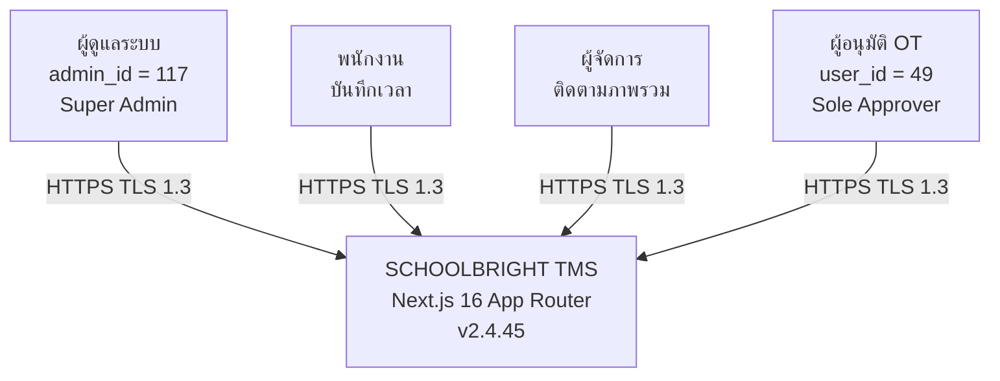

**Diagram 1b — ระบบ → Databases**

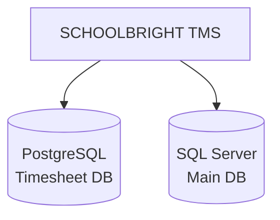

**Diagram 1c — ระบบ → External Services**

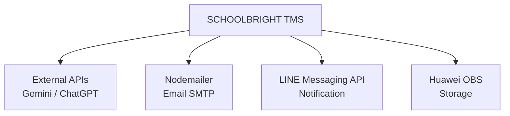

---

## §2 · ผังระบบงานระดับสูง (High-Level Interface Map)

**Diagram 2a — Frontend → API Routing**

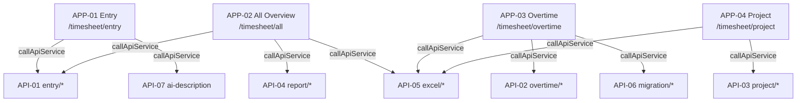

**Diagram 2b — API → ORM → Database**

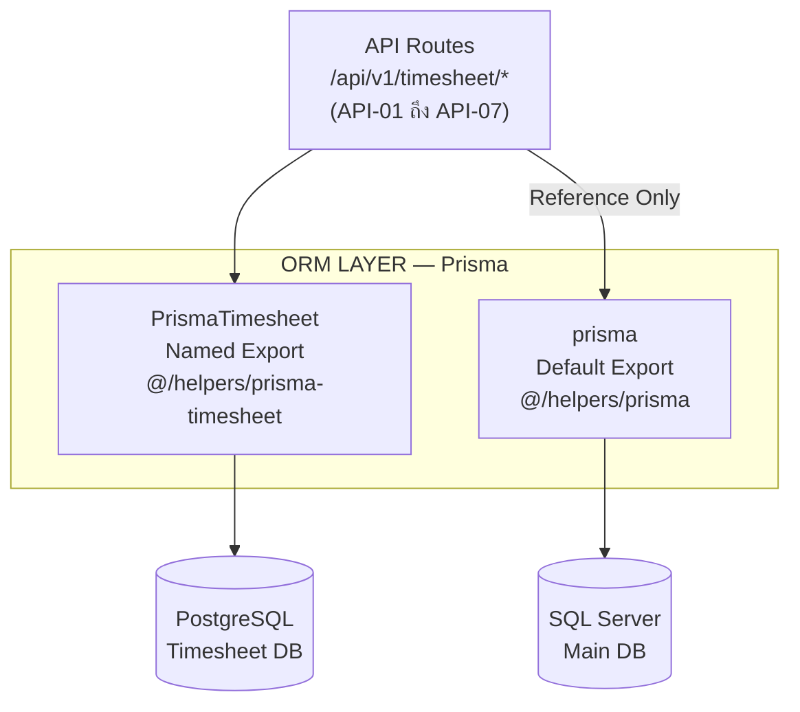

---

## §3 · การเชื่อมต่อ Frontend ↔ Backend (Layer Interface Detail)

### 3.1 HTTP Client ที่ใช้งาน

| Client           | ไฟล์                                             | วัตถุประสงค์                                     | ใช้ใน                    |
| ---------------- | ------------------------------------------------ | ------------------------------------------------ | ------------------------ |
| `callApiService` | `src/services/axios-instance/sb-helper.axios.ts` | เรียก API ภายใน `/api/v*/...`                    | ทุก Frontend Component   |
| `axios` (direct) | import ตรง                                       | เรียก API ภายใน (บาง Service เก่า)               | OT Service บางส่วน       |
| `fetch`          | Native                                           | เรียก Image Proxy / Logger (หลีกเลี่ยง circular) | Image Base64, API Logger |

### 3.2 ผัง Interface ระดับ Component (APP-01 · Entry)

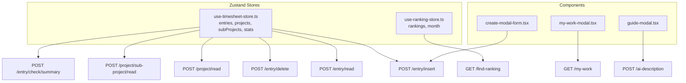

### 3.3 ผัง Interface ระดับ Component (APP-02 · All Overview)

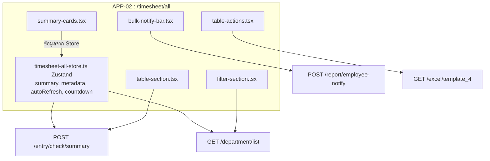

### 3.4 ผัง Interface ระดับ Component (APP-03 · Overtime)

**Diagram 3.4a — Store + CRUD Operations**

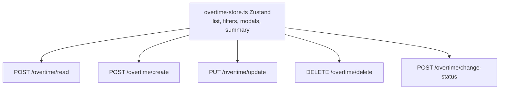

**Diagram 3.4b — Modal → API Connections**

```mermaid
flowchart TD
    OT_C1["create-modal.tsx"]
    OT_C2["detail-modal.tsx"]
    OT_C3["batch-status-modal.tsx"]
    OT_C4["export-modal.tsx"]
    OT_C5["analytics-modal.tsx"]
    OT_C6["remind-modal.tsx"]
    OT_C7["pay-calculator-modal.tsx"]
    OT_C8["timeline-modal.tsx"]
    OT_C9["bulk-download-modal.tsx"]
    O2["POST /overtime/create"]
    O1["POST /overtime/read"]
    O5["POST /overtime/change-status"]
    O6["POST /overtime/export"]
    O7["POST /overtime/analytics"]
    O8["POST /overtime/send-email-bulk"]
    O9["GET /timeline"]
    O10["POST /overtime/upload-images"]
    CALC["Client-side only"]
    OT_C1 --> O2
    OT_C2 --> O1
    OT_C2 --> O10
    OT_C3 --> O5
    OT_C4 --> O6
    OT_C5 --> O7
    OT_C6 --> O8
    OT_C7 --> CALC
    OT_C8 --> O9
    OT_C9 --> O6
```

### 3.5 ผัง Interface ระดับ Component (APP-04 · Project)

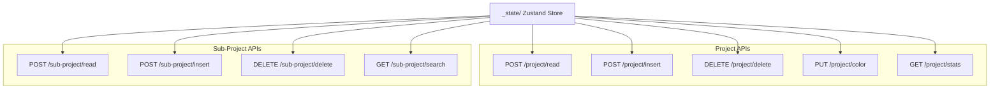

---

## §4 · ผังการไหลของ Request (Request Flow per Module)

### 4.1 Timesheet Entry — Insert Flow

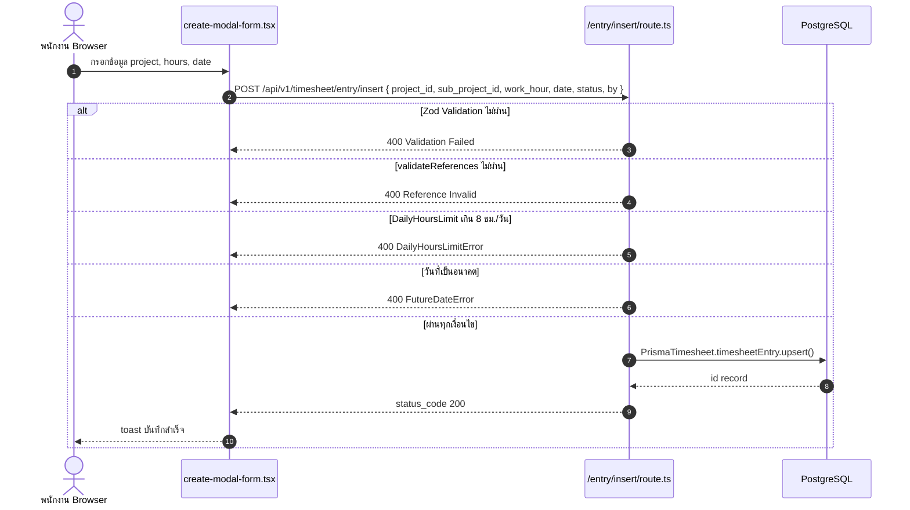

### 4.2 Overtime — Create & Email Notification Flow

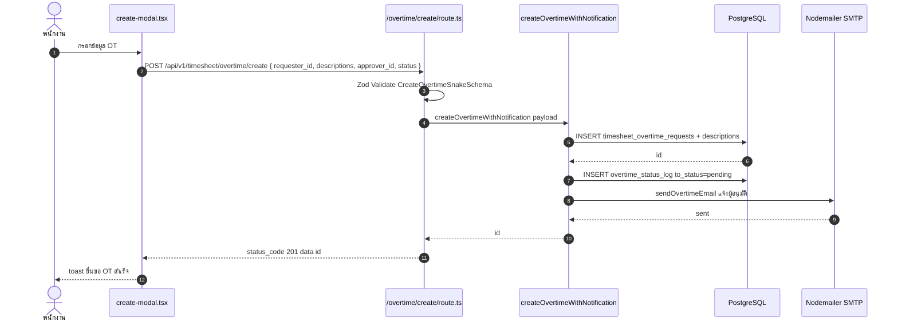

### 4.3 Overtime — Change Status Flow (Authorization Guard)

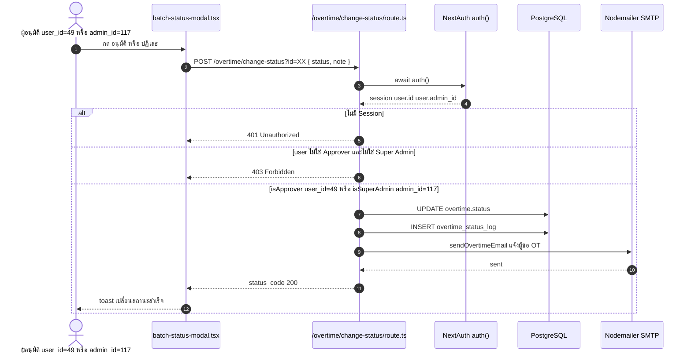

> **Authorization Matrix**
>
> | ผู้ใช้งาน        | ผ่าน/ไม่ผ่าน | เงื่อนไข                 |
> | ---------------- | ------------ | ------------------------ |
> | user_id = "49"   | PASS         | Sole OT Approver         |
> | admin_id = 117   | PASS         | Super Admin (Bypass All) |
> | user อื่นทั้งหมด | FAIL (403)   | ไม่มีสิทธิ์              |
> | ไม่มี Session    | FAIL (401)   | Unauthorized             |

### 4.4 AI Auto-Fill Flow

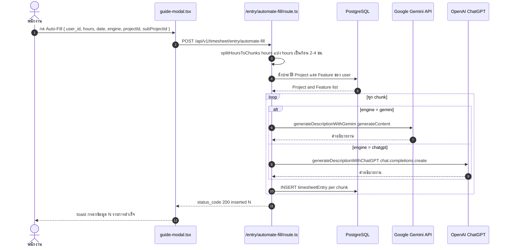

### 4.5 Excel Export Flow

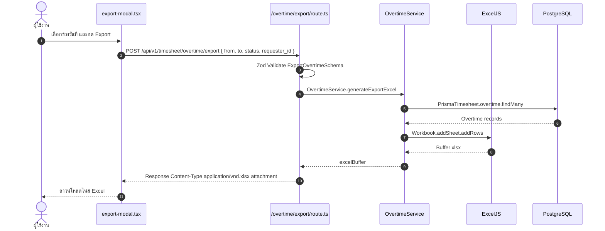

### 4.6 OT Image Upload Flow (Proof of Work)

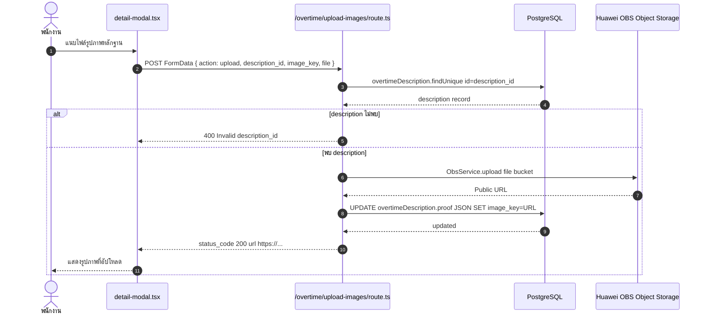

---

## §5 · การเชื่อมต่อฐานข้อมูล (Database Interface)

### 5.1 ORM → Database Mapping

**Diagram 5.1a — API Routes → ORM Layer**

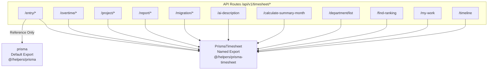

**Diagram 5.1b — ORM → Database**

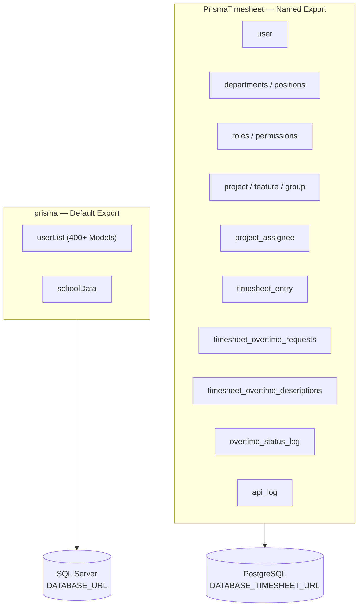

### 5.2 Prisma Singleton Pattern

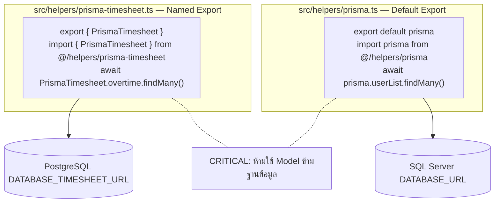

---

## §6 · การเชื่อมต่อบริการภายนอก (External Service Interface)

### 6.1 External Service Map

**Diagram 6.1a — Email Service Connections**

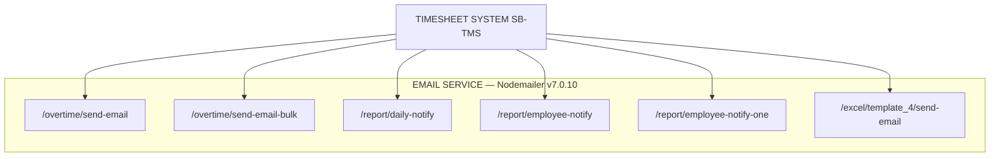

**Diagram 6.1b — AI Service Connections**

```mermaid
flowchart TD
    GEM["Google Gemini API\nENV: GEMINI_API_KEY"]
    GPT["OpenAI ChatGPT\nENV: OPENAI_API_KEY"]
    AI1["/entry/automate-fill"]
    AI2["/ai-description"]
    AI3["/migration/automate-fill"]
    GEM --> AI1
    GEM --> AI2
    GEM --> AI3
    GPT --> AI1
```

**Diagram 6.1c — Storage Service Connections**

```mermaid
flowchart TD
    TMS["TIMESHEET SYSTEM SB-TMS"]
    subgraph STORAGE["FILE STORAGE — Huawei OBS esdk-obs-nodejs"]
        ST1["/overtime/upload-images"]
        ST2["/api/v1/proxy/image"]
    end
    TMS --> ST1
    TMS --> ST2
```

### 6.2 External Service Response Contract

| บริการ          | Protocol        | Format      | Trigger                                |
| --------------- | --------------- | ----------- | -------------------------------------- |
| Google Gemini   | HTTPS/REST      | JSON        | AI Auto-Fill, AI Description           |
| OpenAI ChatGPT  | HTTPS/REST      | JSON        | AI Auto-Fill (engine=chatgpt)          |
| Nodemailer SMTP | SMTP/TLS        | MIME        | OT Create, Status Change, Daily Report |
| Huawei OBS      | HTTPS/S3-compat | Binary/JSON | OT Image Upload                        |
| LINE Messaging  | HTTPS/REST      | JSON        | Notification (line-push.service)       |

---

## §7 · ผังสิทธิ์และการยืนยันตัวตน (Auth & Permission Interface)

### 7.1 Authentication Flow

```mermaid
flowchart TD
    REQ["Client Request"]
    AUTH["NextAuth v5.0.0-beta.31<br/>Credentials Provider — src/auth.ts"]
    SESSION_CHECK{{"มี Session?"}}
    LOGIN_FAIL["Redirect Login Page"]
    METHOD["วิธี Login<br/>Email case-insensitive / Employee Code / Username"]
    PW_BCRYPT["bcryptjs.compare Primary"]
    PW_PLAIN["Plain-text fallback Legacy"]
    LOCK{{"Failed >= 5 ครั้ง?"}}
    LOCKOUT["Lockout 15 นาที Auto-unlock"]
    JWT["สร้าง JWT Session Token"]
    PAYLOAD["Payload: id · admin_id · username · employee_code<br/>role_id · role_name · permissions[]<br/>firstname_th · lastname_th · department · position · email · last_login"]
    REQ --> AUTH --> SESSION_CHECK
    SESSION_CHECK -->|ไม่มี| LOGIN_FAIL
    SESSION_CHECK -->|มี| METHOD
    METHOD --> PW_BCRYPT
    METHOD --> PW_PLAIN
    PW_BCRYPT --> LOCK
    PW_PLAIN --> LOCK
    LOCK -->|ใช่| LOCKOUT
    LOCK -->|ไม่ใช่| JWT --> PAYLOAD
```

### 7.2 Permission Check Interface

```mermaid
flowchart TD
    subgraph FE["FRONTEND — useHasPermission() src/hooks/use-has-permission.ts"]
        FE_1["can PERMISSION_CODE — ตรวจสอบสิทธิ์เดี่ยว"]
        FE_2["can CODE_A CODE_B — OR Logic"]
        FE_3["isAdmin — admin_id === 117 Bypass ทุกอย่าง"]
    end
    subgraph BE["BACKEND — API Route Check"]
        BE_1["const session = await auth()"]
        BE_2["const permissions = session?.user?.permissions or []"]
        SA{{"admin_id === 117?"}}
        OTA{{"user_id === 49?"}}
        BYPASS["Super Admin: bypass ทุกการตรวจสอบ"]
        APPROVE["OT Approver: อนุมัติและปฏิเสธ OT ได้"]
        REJECT["403 Forbidden"]
        BE_1 --> BE_2 --> SA
        SA -->|ใช่| BYPASS
        SA -->|ไม่ใช่| OTA
        OTA -->|ใช่| APPROVE
        OTA -->|ไม่ใช่| REJECT
    end
```

> **Permission Pattern:** `{{module}}.{{resource}}.{{action}}` — ตัวอย่าง: `TIMESHEET.ENTRY.CREATE`, `TIMESHEET.OT.APPROVE`

### 7.3 Role-Based Access Control (RBAC)

```mermaid
flowchart TD
    USER["User\nuser table"]
    ROLE["Role\nroles table"]
    RP["RolePermission\nrole_permissions table"]
    PERM["Permission\npermissions table"]
    PCODE["p_code\nUNIQUE Index"]
    SESSION["Session Token\npermissions[] array of p_codes"]
    USER -->|role_id FK| ROLE
    ROLE --> RP
    RP --> PERM
    PERM -->|p_code| PCODE
    PCODE -->|ถูกนำไปใส่ใน| SESSION
    USER -->|JWT carries| SESSION
```

---

## §8 · ตารางสรุปจุดเชื่อมต่อทั้งหมด (Interface Endpoint Registry)

### 8.1 Frontend → Backend Interface Registry

| #   | Source (Frontend)         | Target Endpoint                                | Method | Auth         | Description          |
| --- | ------------------------- | ---------------------------------------------- | ------ | ------------ | -------------------- |
| 1   | entry/create-modal-form   | `/api/v1/timesheet/entry/insert`               | POST   | Session      | บันทึก/แก้ไข Entry   |
| 2   | entry/timesheet-api       | `/api/v1/timesheet/entry/read`                 | POST   | Session      | ดึงรายการ Entry      |
| 3   | entry/timesheet-api       | `/api/v1/timesheet/entry/delete`               | POST   | Session      | ลบ Entry             |
| 4   | entry/timesheet-api       | `/api/v1/timesheet/project/read`               | POST   | Session      | ดึงรายการ Project    |
| 5   | entry/timesheet-api       | `/api/v1/timesheet/project/sub-project/read`   | POST   | Session      | ดึง Sub-Project      |
| 6   | entry/timesheet-api       | `/api/v1/timesheet/entry/check/summary`        | POST   | Session      | สรุปรายสัปดาห์       |
| 7   | entry/my-work-modal       | `/api/v1/timesheet/my-work`                    | GET    | Session      | งานที่รับผิดชอบ      |
| 8   | entry/guide-modal         | `/api/v1/timesheet/ai-description`             | POST   | Session      | AI สร้างคำอธิบาย     |
| 9   | entry/ranking-api         | `/api/v1/timesheet/find-ranking`               | GET    | Session      | กระดานอันดับ         |
| 10  | all/timesheet-all-api     | `/api/v1/timesheet/entry/check/summary`        | POST   | Session      | สรุปภาพรวมองค์กร     |
| 11  | all/timesheet-all-api     | `/api/v1/timesheet/department/list`            | GET    | Session      | รายชื่อแผนก          |
| 12  | all/bulk-notify-bar       | `/api/v1/timesheet/report/employee-notify`     | POST   | Session      | แจ้งเตือนหมู่        |
| 13  | all/table-actions         | `/api/v1/timesheet/excel/template_4`           | GET    | Session      | Export Excel         |
| 14  | overtime/create-modal     | `/api/v1/timesheet/overtime/create`            | POST   | Session      | ยื่นขอ OT            |
| 15  | overtime/overtime-service | `/api/v1/timesheet/overtime/read`              | POST   | Session      | ดึงรายการ OT         |
| 16  | overtime/overtime-service | `/api/v1/timesheet/overtime/update`            | PUT    | Session      | แก้ไข OT             |
| 17  | overtime/overtime-service | `/api/v1/timesheet/overtime/delete`            | DELETE | Session      | ลบ OT                |
| 18  | overtime/batch-status     | `/api/v1/timesheet/overtime/change-status`     | POST   | Session+Role | อนุมัติ/ปฏิเสธ       |
| 19  | overtime/export-modal     | `/api/v1/timesheet/overtime/export`            | POST   | Session      | Export OT Excel      |
| 20  | overtime/analytics-modal  | `/api/v1/timesheet/overtime/analytics`         | POST   | Session      | Dashboard OT         |
| 21  | overtime/remind-modal     | `/api/v1/timesheet/overtime/send-email-bulk`   | POST   | Session      | แจ้งเตือน Email หมู่ |
| 22  | overtime/timeline-modal   | `/api/v1/timesheet/timeline`                   | GET    | Session      | Timeline             |
| 23  | overtime/detail-modal     | `/api/v1/timesheet/overtime/upload-images`     | POST   | Session      | อัปโหลดรูปหลักฐาน    |
| 24  | project/page              | `/api/v1/timesheet/project/insert`             | POST   | Session      | สร้าง Project        |
| 25  | project/page              | `/api/v1/timesheet/project/delete`             | DELETE | Session      | ลบ Project           |
| 26  | project/page              | `/api/v1/timesheet/project/color`              | PUT    | Session      | เปลี่ยนสี            |
| 27  | project/page              | `/api/v1/timesheet/project/stats`              | GET    | Session      | สถิติ Project        |
| 28  | project/page              | `/api/v1/timesheet/project/sub-project/search` | GET    | Session      | ค้นหา Sub-Project    |

### 8.2 Backend → External Service Interface Registry

| #   | Source (API Route)             | Target Service       | Protocol   | Trigger                |
| --- | ------------------------------ | -------------------- | ---------- | ---------------------- |
| 1   | `/overtime/create`             | Nodemailer SMTP      | SMTP/TLS   | สร้าง OT ใหม่          |
| 2   | `/overtime/change-status`      | Nodemailer SMTP      | SMTP/TLS   | เปลี่ยนสถานะ OT        |
| 3   | `/overtime/send-email`         | Nodemailer SMTP      | SMTP/TLS   | แจ้งเตือน Manual       |
| 4   | `/overtime/send-email-bulk`    | Nodemailer SMTP      | SMTP/TLS   | แจ้งเตือนหมู่          |
| 5   | `/report/daily-notify`         | Nodemailer SMTP      | SMTP/TLS   | รายงานรายวัน           |
| 6   | `/report/employee-notify`      | Nodemailer SMTP      | SMTP/TLS   | แจ้งพนักงานหมู่        |
| 7   | `/report/employee-notify-one`  | Nodemailer SMTP      | SMTP/TLS   | แจ้งพนักงานรายบุคคล    |
| 8   | `/excel/template_4/send-email` | Nodemailer SMTP      | SMTP/TLS   | ส่ง Excel ทาง Email    |
| 9   | `/entry/automate-fill`         | Google Gemini API    | HTTPS/REST | AI Fill engine=gemini  |
| 10  | `/entry/automate-fill`         | OpenAI ChatGPT       | HTTPS/REST | AI Fill engine=chatgpt |
| 11  | `/ai-description`              | Google Gemini API    | HTTPS/REST | สร้างคำอธิบาย          |
| 12  | `/migration/automate-fill`     | Google Gemini API    | HTTPS/REST | AI ช่วยนำเข้า          |
| 13  | `/overtime/upload-images`      | Huawei OBS           | HTTPS/S3   | อัปโหลดรูปหลักฐาน      |
| 14  | `/overtime/read`               | Huawei OBS via proxy | HTTPS      | แสดงรูปใน Frontend     |

### 8.3 Backend → Database Interface Registry

| #   | API Group              | ORM Instance    | Database   | Operation                            |
| --- | ---------------------- | --------------- | ---------- | ------------------------------------ |
| 1   | entry/\*               | PrismaTimesheet | PostgreSQL | CRUD timesheet_entry                 |
| 2   | overtime/\*            | PrismaTimesheet | PostgreSQL | CRUD timesheet_overtime_requests     |
| 3   | overtime/\*            | PrismaTimesheet | PostgreSQL | CRUD timesheet_overtime_descriptions |
| 4   | overtime/change-status | PrismaTimesheet | PostgreSQL | INSERT overtime_status_log           |
| 5   | overtime/upload-images | PrismaTimesheet | PostgreSQL | UPDATE proof JSON field              |
| 6   | project/\*             | PrismaTimesheet | PostgreSQL | CRUD project, feature                |
| 7   | project/sub-project    | PrismaTimesheet | PostgreSQL | CRUD feature, project_assignee       |
| 8   | department/list        | PrismaTimesheet | PostgreSQL | READ departments                     |
| 9   | find-ranking           | PrismaTimesheet | PostgreSQL | READ timesheet_entry aggregate       |
| 10  | my-work                | PrismaTimesheet | PostgreSQL | READ project_assignee + feature      |
| 11  | report/\*              | PrismaTimesheet | PostgreSQL | READ complex aggregations            |
| 12  | migration/\*           | PrismaTimesheet | PostgreSQL | BULK INSERT / READ                   |
| 13  | user lookup            | prisma default  | SQL Server | READ userList reference              |

---

## ภาคผนวก · ผังสรุปการเชื่อมโยงทั้งหมด (Master Interface Summary)

**Diagram A.1 — Client → Next.js Layer**

```mermaid
flowchart TD
    BROWSER["User Interface\nChrome / Safari / Mobile Browser"]
    subgraph PAGES["FRONTEND PAGES /timesheet/*"]
        FE["entry / all / overtime / project / report\nState: Zustand + Redux Toolkit\nHTTP: callApiService Axios"]
    end
    BROWSER -->|HTTPS / TLS 1.3| FE
```

**Diagram A.2 — API Routes → Databases**

```mermaid
flowchart TD
    FE["Frontend Pages"]
    subgraph APIROUTES["API ROUTES /api/v1/timesheet/*"]
        PIPELINE["Validate Zod\nAuth NextAuth\nService Layer\nORM Prisma\nResponse Helpers"]
    end
    PG[("PostgreSQL\nPrismaTimesheet Named Export")]
    MSSQL[("SQL Server\nprisma Default Export")]
    FE -->|Internal HTTP| PIPELINE
    PIPELINE --> PG
    PIPELINE -->|Reference Only| MSSQL
```

**Diagram A.3 — API Routes → External Services**

```mermaid
flowchart TD
    PIPELINE["API Routes /api/v1/timesheet/*"]
    GEM["Google Gemini API\nOpenAI API\nAI Features"]
    SMTP["Nodemailer SMTP\nEmail Notifications"]
    OBS["Huawei OBS\nObject Storage"]
    PIPELINE --> GEM
    PIPELINE --> SMTP
    PIPELINE --> OBS
```

### สรุปจำนวน Interface

| ประเภท Interface                       | จำนวน  |
| -------------------------------------- | ------ |
| Frontend → Backend (API Calls)         | 28     |
| Backend → External Services (Outbound) | 14     |
| Backend → Database (ORM Queries)       | 13     |
| Database → Database (Cross-reference)  | 1      |
| **รวมทั้งหมด**                         | **56** |

---

> **Document Control**
>
> | รายการ              | รายละเอียด                                                    |
> | ------------------- | ------------------------------------------------------------- |
> | ผู้จัดทำ            | Senior Full-Stack Developer, SchoolBright                     |
> | วันที่จัดทำ         | 22 เมษายน พ.ศ. 2569                                           |
> | เวอร์ชันเอกสาร      | 1.1.0 (Mermaid Diagrams)                                      |
> | อ้างอิงจาก          | Source Code v2.4.45, API Routes, Service Layer, Prisma Schema |
> | ระดับความลับ        | INTERNAL — FOR AUDITOR USE ONLY                               |
> | เอกสารที่เกี่ยวข้อง | `_doc/timesheet/application-list.md`                          |

---

_เอกสารนี้สร้างจาก Source Code จริงของระบบ SchoolBright Timesheet Management System_
_สงวนสิทธิ์ — SchoolBright Co., Ltd._
