````markdown
# APPLICATION LIST REPORT

## ระบบบริหารจัดการเวลาทำงาน (Timesheet Management System)

---

> **Organization:** SchoolBright Co., Ltd.
> **System Scope:** Timesheet Management System (TMS)
> **Document Version:** 2.4.45
> **Prepared Date:** 22 เมษายน พ.ศ. 2569
> **Classification:** INTERNAL — FOR AUDITOR USE ONLY
> **Target Path:** `_doc/timesheet/APPLICATION_LIST_REPORT.md`

---

## สารบัญ (Table of Contents)

| หมวด | รายการ                                                | หน้า |
| ---- | ----------------------------------------------------- | ---- |
| 1    | ภาพรวมระบบ (System Overview)                          | §1   |
| 2    | สถาปัตยกรรมระบบ (System Architecture Diagram)         | §2   |
| 3    | รายชื่อระบบงาน (Application Inventory)                | §3   |
| 4    | รายละเอียดระบบงานแต่ละระบบ (Application Details)      | §4   |
| 5    | โมเดลฐานข้อมูล (Database Schema)                      | §5   |
| 6    | ผังการไหลของข้อมูล (Data Flow Diagram)                | §6   |
| 7    | ข้อมูลโครงสร้างพื้นฐาน (Infrastructure Specification) | §7   |
| 8    | สรุปความสัมพันธ์ระบบ (Integration Map)                | §8   |

---

## §1 · ภาพรวมระบบ (System Overview)

ระบบบริหารจัดการเวลาทำงาน (Timesheet Management System — TMS) เป็นแพลตฟอร์มภายใน (Internal Back-office) ของ SchoolBright ที่พัฒนาขึ้นเพื่อรองรับการบันทึกเวลาทำงาน การขอทำงานล่วงเวลา และการติดตามความคืบหน้าของโครงการ สำหรับบุคลากรภายในองค์กรทั้งหมด

| รายการ             | รายละเอียด                                 |
| ------------------ | ------------------------------------------ |
| ชื่อระบบ           | Timesheet Management System (TMS)          |
| รหัสระบบ           | SB-TMS                                     |
| เจ้าของระบบ        | SchoolBright Co., Ltd.                     |
| ประเภทระบบ         | Internal Back-office Web Application       |
| กลุ่มผู้ใช้งานหลัก | บุคลากรภายในองค์กร, ผู้จัดการ, ผู้ดูแลระบบ |
| วันที่เริ่มใช้งาน  | 2566                                       |
| สถานะปัจจุบัน      | ACTIVE — Production                        |
| เวอร์ชันปัจจุบัน   | v2.4.45                                    |

---

## §2 · สถาปัตยกรรมระบบ (System Architecture Diagram)

### 2.1 ภาพรวมสถาปัตยกรรม (High-Level Architecture)

**Diagram 2.1a — System Layers**

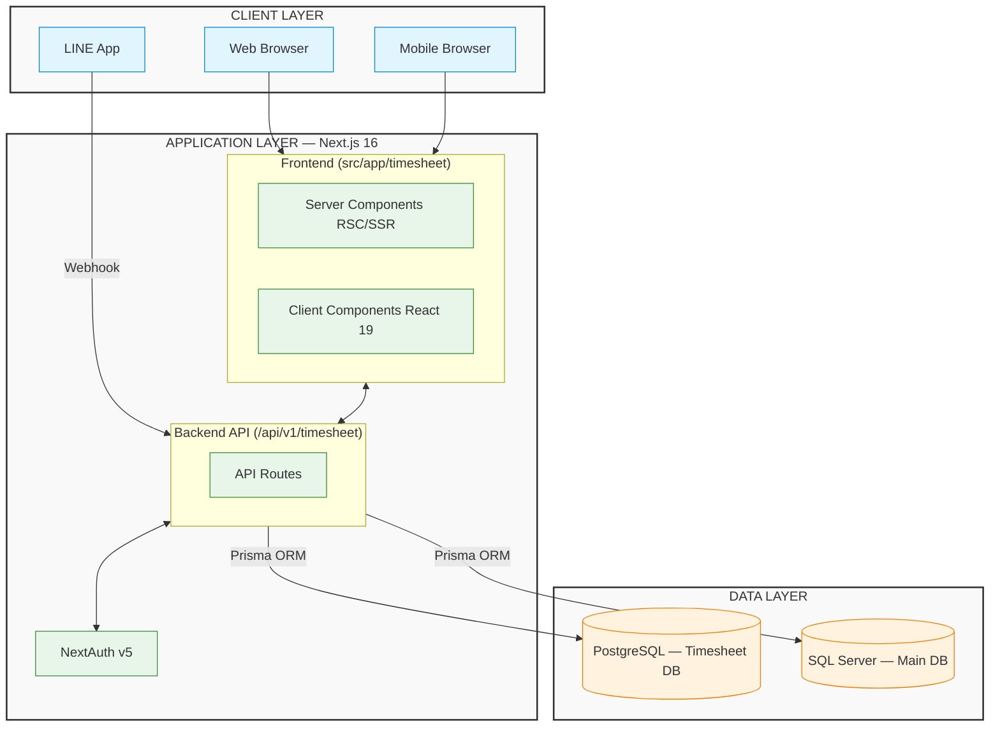

**Diagram 2.1b — External Service Integrations**

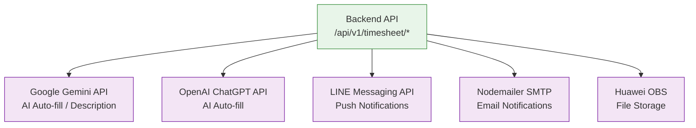
````

### 2.2 โครงสร้างโฟลเดอร์ (Directory Structure)

```text
src/
├── app/
│   ├── timesheet/                     ← Frontend (Pages / UI Components)
│   │   ├── layout.tsx                 ← Shared Layout
│   │   ├── entry/                     ← [APP-01] บันทึกเวลาทำงานส่วนตัว
│   │   ├── all/                       ← [APP-02] ภาพรวมเวลาทำงานทั้งองค์กร
│   │   ├── overtime/                  ← [APP-03] จัดการล่วงเวลา
│   │   └── project/                   ← [APP-04] จัดการโครงการ
│   │
│   └── api/v1/timesheet/              ← Backend (API Routes / Controllers)
│       ├── entry/                     ← [API-01] จัดการข้อมูล Entry
│       ├── overtime/                  ← [API-02] จัดการ Overtime
│       ├── project/                   ← [API-03] จัดการ Project
│       ├── report/                    ← [API-04] รายงานและ Analytics
│       ├── excel/                     ← [API-05] ส่งออก Excel
│       ├── migration/                 ← [API-06] นำเข้าข้อมูล
│       └── ai-description/            ← [API-07] AI Assistant
│
└── prisma/timesheet/
    └── schema.prisma                  ← Database Schema (PostgreSQL)
```

---

## §3 · รายชื่อระบบงาน (Application Inventory)

### 3.1 ตารางสรุประบบงานทั้งหมด

| รหัส   | ชื่อระบบงาน                  | ประเภท        | เส้นทาง (Path)                              | สถานะ  |
| ------ | ---------------------------- | ------------- | ------------------------------------------- | ------ |
| APP-01 | ระบบบันทึกเวลาทำงานส่วนตัว   | Frontend Page | `/timesheet/entry`                          | ACTIVE |
| APP-02 | ระบบภาพรวมเวลาทำงานองค์กร    | Frontend Page | `/timesheet/all`                            | ACTIVE |
| APP-03 | ระบบจัดการทำงานล่วงเวลา      | Frontend Page | `/timesheet/overtime`                       | ACTIVE |
| APP-04 | ระบบจัดการโครงการ            | Frontend Page | `/timesheet/project`                        | ACTIVE |
| APP-05 | ระบบรายงานเส้นเวลา           | Sub-Page      | `/timesheet/all/report/timeline`            | ACTIVE |
| APP-06 | ระบบรายงาน Capturable Assets | Sub-Page      | `/timesheet/all/report/capturable`          | ACTIVE |
| APP-07 | ระบบนำเข้าข้อมูลบุคลากร      | Sub-Page      | `/timesheet/all/report/migrate-person`      | ACTIVE |
| APP-08 | ระบบนำเข้าข้อมูลโครงการ      | Sub-Page      | `/timesheet/all/report/migrate-project`     | ACTIVE |
| API-01 | Entry Management API         | Backend API   | `/api/v1/timesheet/entry/*`                 | ACTIVE |
| API-02 | Overtime Management API      | Backend API   | `/api/v1/timesheet/overtime/*`              | ACTIVE |
| API-03 | Project Management API       | Backend API   | `/api/v1/timesheet/project/*`               | ACTIVE |
| API-04 | Report & Analytics API       | Backend API   | `/api/v1/timesheet/report/*`                | ACTIVE |
| API-05 | Excel Export API             | Backend API   | `/api/v1/timesheet/excel/*`                 | ACTIVE |
| API-06 | Migration API                | Backend API   | `/api/v1/timesheet/migration/*`             | ACTIVE |
| API-07 | AI Description API           | Backend API   | `/api/v1/timesheet/ai-description`          | ACTIVE |
| API-08 | Department List API          | Backend API   | `/api/v1/timesheet/department/list`         | ACTIVE |
| API-09 | Timeline API                 | Backend API   | `/api/v1/timesheet/timeline`                | ACTIVE |
| API-10 | Calculate Summary API        | Backend API   | `/api/v1/timesheet/calculate-summary-month` | ACTIVE |
| API-11 | Find Ranking API             | Backend API   | `/api/v1/timesheet/find-ranking`            | ACTIVE |
| API-12 | My Work API                  | Backend API   | `/api/v1/timesheet/my-work`                 | ACTIVE |

---

## §4 · รายละเอียดระบบงานแต่ละระบบ (Application Details)

---

### APP-01 · ระบบบันทึกเวลาทำงานส่วนตัว (Personal Timesheet Entry)

> **Path:** `src/app/timesheet/entry` | **Type:** Client Component (React 19) | **Auth:** Required

**หน้าที่และความรับผิดชอบ:**

- **บันทึกเวลาทำงานรายวัน:** พนักงานบันทึกชั่วโมงทำงานต่อโครงการและ Feature
- **ดู Calendar View:** แสดงภาพรวมการบันทึกเวลาในรูปแบบปฏิทิน
- **ผู้ช่วย AI กรอกข้อมูล:** ใช้ Gemini/ChatGPT ช่วยสร้างคำอธิบายงานอัตโนมัติ

**API ที่เรียกใช้งานหลัก:**

- `POST /api/v1/timesheet/entry/insert` (บันทึกรายการ)
- `GET /api/v1/timesheet/entry/read` (ดึงข้อมูล)
- `POST /api/v1/timesheet/ai-description` (AI Generator)

---

### APP-02 · ระบบภาพรวมเวลาทำงานองค์กร (Organization Timesheet Overview)

> **Path:** `src/app/timesheet/all` | **Type:** Client Component (React 19) | **Auth:** Required + Permission Check

**หน้าที่และความรับผิดชอบ:**

- **ภาพรวมองค์กร:** แสดงสถิติการบันทึกเวลาของพนักงานทั้งหมด
- **Summary Cards & Auto-Refresh:** การ์ดสรุปจำนวนพนักงาน พร้อมรีเฟรชข้อมูลอัตโนมัติ
- **แจ้งเตือนหมู่:** ส่งการแจ้งเตือนไปยังพนักงานที่ยังไม่บันทึกผ่าน LINE/Email

**ระบบย่อย (Sub-Systems):**

- **APP-05:** รายงานเส้นเวลา (`/report/timeline`)
- **APP-06:** รายงาน Capturable Assets (`/report/capturable`)

---

### APP-03 · ระบบจัดการทำงานล่วงเวลา (Overtime Management System)

> **Path:** `src/app/timesheet/overtime` | **Type:** Client Component (React 19) | **Auth:** Required + Permission + Role Check

**หน้าที่และความรับผิดชอบ:**

- **ยื่นขอล่วงเวลา:** พนักงานสร้างคำขอ OT พร้อมรายละเอียดและแนบหลักฐาน
- **อนุมัติ/ปฏิเสธ OT:** ผู้มีสิทธิ์ดำเนินการผ่าน Batch หรือรายบุคคล
- **คำนวณค่าล่วงเวลา:** Pay Calculator คำนวณค่าตอบแทน พร้อมส่งออก PDF/Excel

**สิทธิ์พิเศษ (Special Authorization):**

> **BYPASS_USER_ID = "49"**
> ผู้ใช้รหัส 49 มีสิทธิ์อนุมัติ/ปฏิเสธ OT แต่เพียงผู้เดียว มีการตรวจสอบทั้งฝั่ง Frontend และ API Route (`/api/v1/timesheet/overtime/change-status`)

---

### APP-04 · ระบบจัดการโครงการ (Project Management System)

> **Path:** `src/app/timesheet/project` | **Type:** Client Component (React 19) | **Auth:** Required + Permission Check

**หน้าที่และความรับผิดชอบ:**

- **จัดการโครงการ และ Sub-Project:** สร้าง แก้ไข ลบ กำหนดสี และบริหาร Feature
- **กำหนดผู้รับผิดชอบ:** Assign สมาชิกเข้าโครงการ
- **Timeline โครงการ:** ดูแผนภูมิเส้นเวลาของโครงการและชั่วโมงที่ใช้งานจริง

---

## §5 · โมเดลฐานข้อมูล (Database Schema)

### 5.1 Entity Relationship Diagram (ERD)

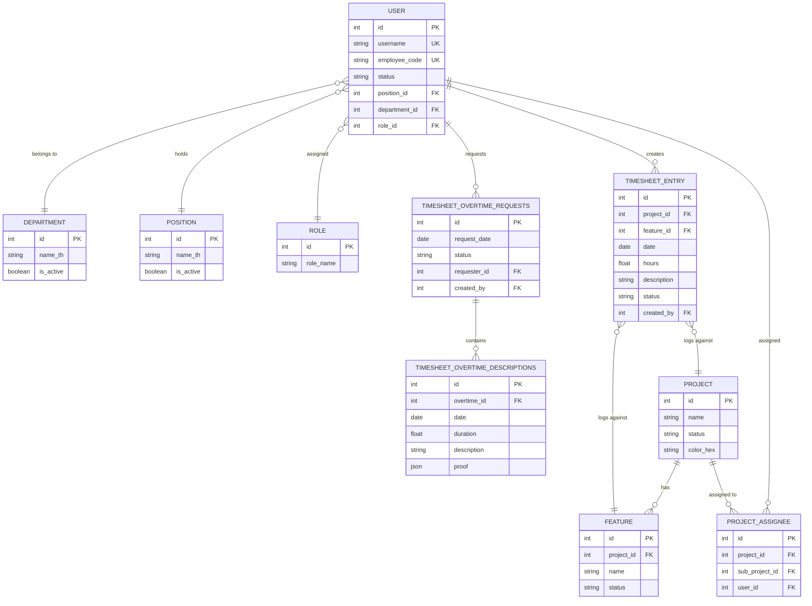

### 5.2 ตารางฐานข้อมูลทั้งหมด

| ชื่อตาราง (Table Name)            | คำอธิบาย                  | จำนวน Index |
| --------------------------------- | ------------------------- | ----------- |
| `user`                            | ข้อมูลผู้ใช้งานและพนักงาน | 4           |
| `departments`, `positions`        | ข้อมูลแผนก และ ตำแหน่งงาน | -           |
| `roles`, `permissions`            | บทบาทและสิทธิ์การเข้าถึง  | -           |
| `project`, `feature`              | ข้อมูลโครงการ และ Feature | -           |
| `project_assignee`                | ผู้รับผิดชอบโครงการ       | -           |
| `timesheet_entry`                 | บันทึกเวลาทำงาน           | 4           |
| `timesheet_overtime_requests`     | คำขอทำงานล่วงเวลา         | 3           |
| `timesheet_overtime_descriptions` | รายละเอียด OT             | 2           |

---

## §6 · ผังการไหลของข้อมูล (Data Flow Diagram)

### 6.1 การบันทึกเวลาทำงาน (Timesheet Entry Flow)

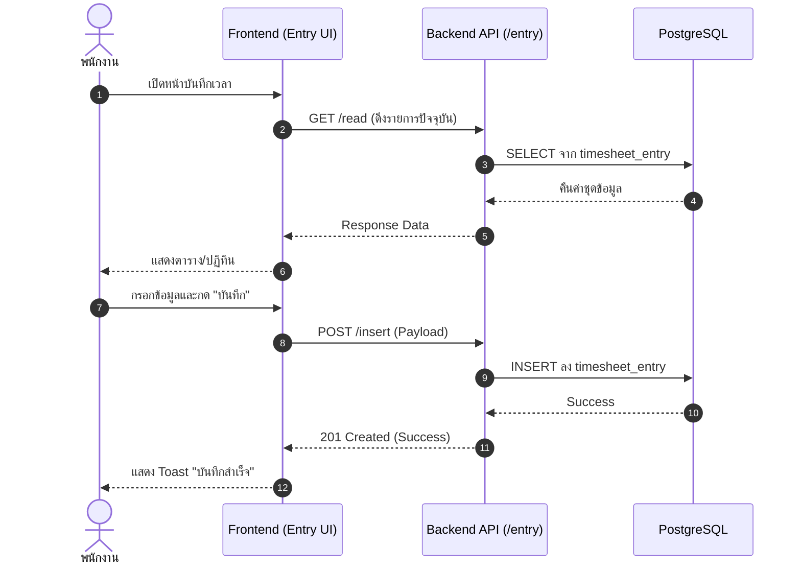

### 6.2 กระบวนการขอและอนุมัติล่วงเวลา (Overtime Approval Flow)

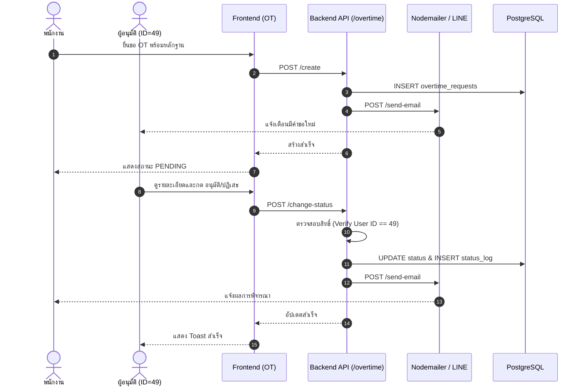

### 6.3 การส่งออกรายงาน (Export Flow)

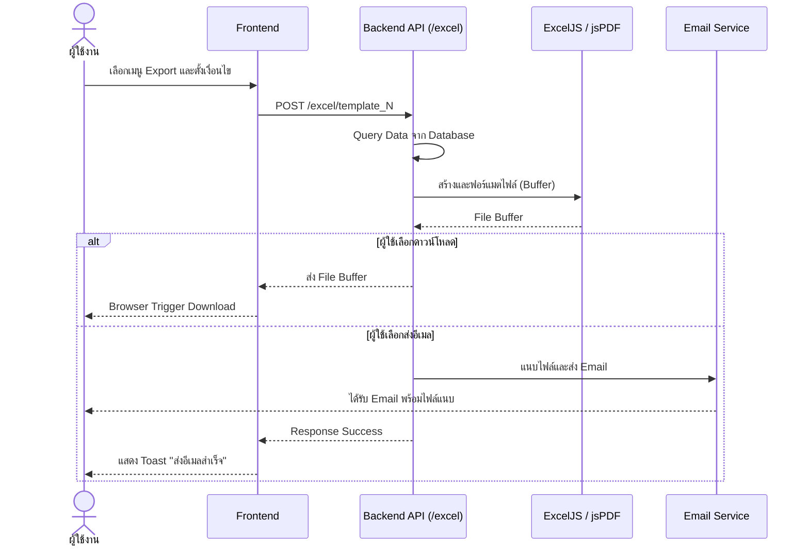

---

## §7 · ข้อมูลโครงสร้างพื้นฐาน (Infrastructure Specification)

### 7.1 Technology Stack Summary

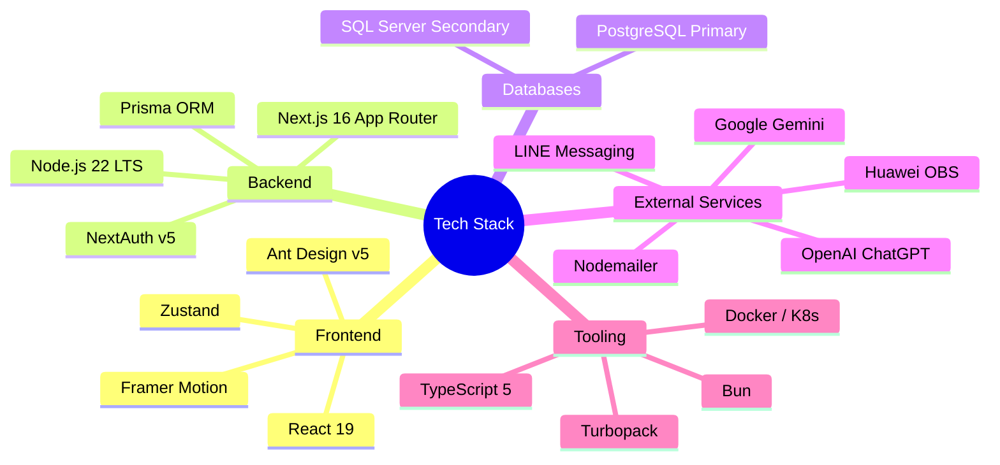

### 7.2 Application & Database Details

| รายการ                  | รายละเอียด                                             |
| :---------------------- | :----------------------------------------------------- |
| **Framework / Runtime** | Next.js v16.2.4 (App Router) / Node.js 22.9.0 LTS      |
| **Primary Database**    | PostgreSQL (Timesheet Management DB) via Prisma v6.8.2 |
| **Secondary Database**  | Microsoft SQL Server (SchoolBright Main DB)            |
| **Package Manager**     | Bun                                                    |
| **Storage**             | Huawei OBS (esdk-obs-nodejs 3.26.2)                    |
| **Deployment Target**   | Kubernetes (Cloud-based / On-Premise Hybrid)           |

---

## §8 · สรุปความสัมพันธ์ระบบ (Integration Map)

### 8.1 ภาพรวมความสัมพันธ์ระบบงาน

**Diagram 8.1a — Frontend → Backend API**

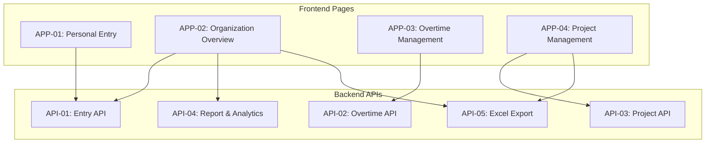

**Diagram 8.1b — Backend API → Database**

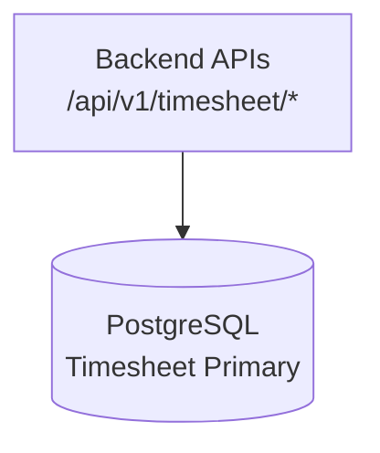

**Diagram 8.1c — Backend API → External Services**

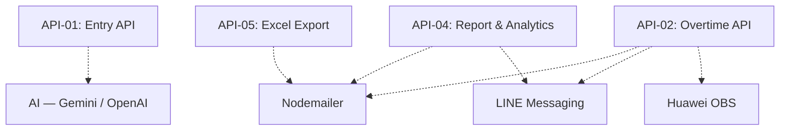

### 8.2 Authentication & Authorization Flow

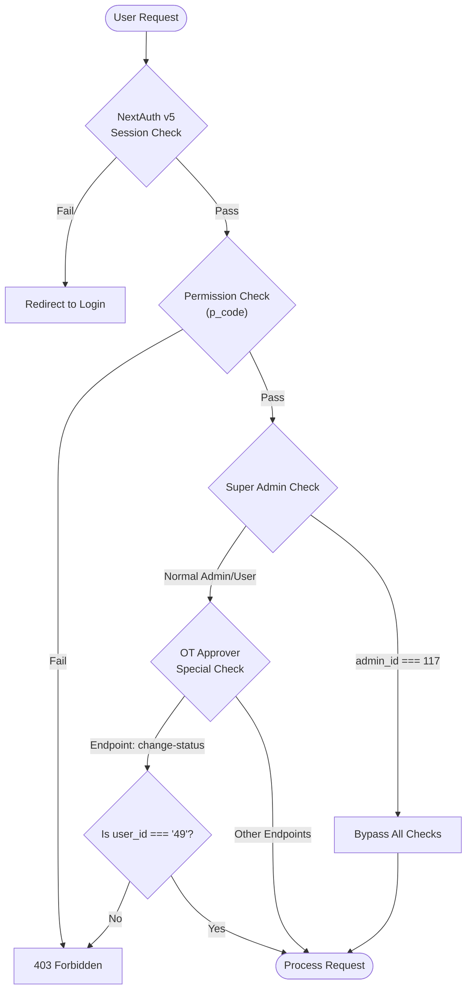

---

## ภาคผนวก (Appendix)

### A · รายการ Environment Variables (สำคัญ)

| Variable                              | วัตถุประสงค์                 | ระดับความลับ |
| ------------------------------------- | ---------------------------- | ------------ |
| `DATABASE_TIMESHEET_URL`              | PostgreSQL Connection String | CRITICAL     |
| `DATABASE_URL`                        | SQL Server Connection String | CRITICAL     |
| `NEXTAUTH_SECRET`                     | NextAuth Signing Key         | CRITICAL     |
| `GEMINI_API_KEY`                      | Google Gemini API            | SECRET       |
| `OPENAI_API_KEY`                      | OpenAI API                   | SECRET       |
| `LINE_CHANNEL_ACCESS_TOKEN`           | LINE Messaging API           | SECRET       |
| `SMTP_HOST`, `SMTP_USER`, `SMTP_PASS` | Email Service                | SECRET       |
| `OBS_*`                               | Huawei OBS Storage           | SECRET       |

---

> **Document Control**
>
> | รายการ         | รายละเอียด                                            |
> | -------------- | ----------------------------------------------------- |
> | ผู้จัดทำ       | Senior Full-Stack Developer, SchoolBright             |
> | วันที่จัดทำ    | 22 เมษายน พ.ศ. 2569                                   |
> | เวอร์ชันเอกสาร | 1.0.0 (Updated with Mermaid Architecture)             |
> | อ้างอิงจาก     | Source Code v2.4.45, `prisma/timesheet/schema.prisma` |
> | ระดับความลับ   | INTERNAL — FOR AUDITOR USE ONLY                       |

---

_เอกสารนี้สร้างจาก Source Code จริงของระบบ SchoolBright Timesheet Management System_
_สงวนสิทธิ์ — SchoolBright Co., Ltd._

```

```
