# APPLICATION LIST REPORT

## Timesheet Management System

---

> **Organization:** SchoolBright Co., Ltd.
> **System Scope:** Timesheet Management System (TMS)
> **Document Version:** 2.4.45
> **Prepared Date:** April 22, 2026
> **Classification:** INTERNAL — FOR AUDITOR USE ONLY
> **Target Path:** `_doc/timesheet/en-application-list.md`

---

## Table of Contents

| Section | Topic                        | Ref |
| ------- | ---------------------------- | --- |
| 1       | System Overview              | §1  |
| 2       | System Architecture Diagram  | §2  |
| 3       | Application Inventory        | §3  |
| 4       | Application Details          | §4  |
| 5       | Database Schema              | §5  |
| 6       | Data Flow Diagram            | §6  |
| 7       | Infrastructure Specification | §7  |
| 8       | Integration Map              | §8  |

---

## §1 · System Overview

The Timesheet Management System (TMS) is an internal back-office platform developed by SchoolBright to support daily work-hour logging, overtime request management, and project progress tracking for all internal personnel.

| Item                | Details                                    |
| ------------------- | ------------------------------------------ |
| System Name         | Timesheet Management System (TMS)          |
| System Code         | SB-TMS                                     |
| System Owner        | SchoolBright Co., Ltd.                     |
| System Type         | Internal Back-office Web Application       |
| Primary User Groups | Employees, Managers, System Administrators |
| Go-Live Date        | 2023                                       |
| Current Status      | ACTIVE — Production                        |
| Current Version     | v2.4.45                                    |

---

## §2 · System Architecture Diagram

### 2.1 High-Level Architecture

**Diagram 2.1a — System Layers**

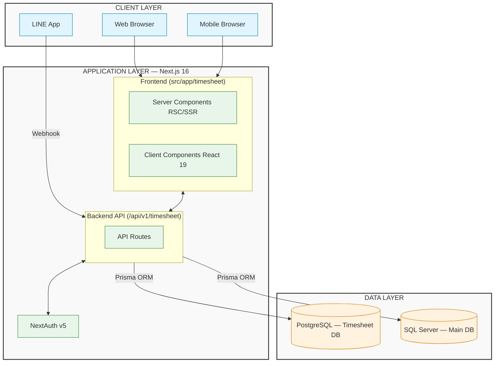

**Diagram 2.1b — External Service Integrations**

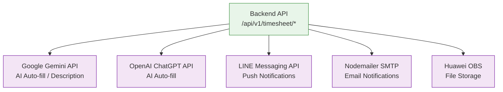

### 2.2 Directory Structure

```text
src/
├── app/
│   ├── timesheet/                     ← Frontend (Pages / UI Components)
│   │   ├── layout.tsx                 ← Shared Layout
│   │   ├── entry/                     ← [APP-01] Personal Timesheet Entry
│   │   ├── all/                       ← [APP-02] Organization-wide Overview
│   │   ├── overtime/                  ← [APP-03] Overtime Management
│   │   └── project/                   ← [APP-04] Project Management
│   │
│   └── api/v1/timesheet/              ← Backend (API Routes / Controllers)
│       ├── entry/                     ← [API-01] Entry Management
│       ├── overtime/                  ← [API-02] Overtime Management
│       ├── project/                   ← [API-03] Project Management
│       ├── report/                    ← [API-04] Reports & Analytics
│       ├── excel/                     ← [API-05] Excel Export
│       ├── migration/                 ← [API-06] Data Migration
│       └── ai-description/            ← [API-07] AI Assistant
│
└── prisma/timesheet/
    └── schema.prisma                  ← Database Schema (PostgreSQL)
```

---

## §3 · Application Inventory

### 3.1 Application Summary Table

| Code   | Application Name                | Type          | Path                                        | Status |
| ------ | ------------------------------- | ------------- | ------------------------------------------- | ------ |
| APP-01 | Personal Timesheet Entry        | Frontend Page | `/timesheet/entry`                          | ACTIVE |
| APP-02 | Organization Timesheet Overview | Frontend Page | `/timesheet/all`                            | ACTIVE |
| APP-03 | Overtime Management System      | Frontend Page | `/timesheet/overtime`                       | ACTIVE |
| APP-04 | Project Management System       | Frontend Page | `/timesheet/project`                        | ACTIVE |
| APP-05 | Timeline Report                 | Sub-Page      | `/timesheet/all/report/timeline`            | ACTIVE |
| APP-06 | Capturable Assets Report        | Sub-Page      | `/timesheet/all/report/capturable`          | ACTIVE |
| APP-07 | Personnel Data Migration        | Sub-Page      | `/timesheet/all/report/migrate-person`      | ACTIVE |
| APP-08 | Project Data Migration          | Sub-Page      | `/timesheet/all/report/migrate-project`     | ACTIVE |
| API-01 | Entry Management API            | Backend API   | `/api/v1/timesheet/entry/*`                 | ACTIVE |
| API-02 | Overtime Management API         | Backend API   | `/api/v1/timesheet/overtime/*`              | ACTIVE |
| API-03 | Project Management API          | Backend API   | `/api/v1/timesheet/project/*`               | ACTIVE |
| API-04 | Report & Analytics API          | Backend API   | `/api/v1/timesheet/report/*`                | ACTIVE |
| API-05 | Excel Export API                | Backend API   | `/api/v1/timesheet/excel/*`                 | ACTIVE |
| API-06 | Migration API                   | Backend API   | `/api/v1/timesheet/migration/*`             | ACTIVE |
| API-07 | AI Description API              | Backend API   | `/api/v1/timesheet/ai-description`          | ACTIVE |
| API-08 | Department List API             | Backend API   | `/api/v1/timesheet/department/list`         | ACTIVE |
| API-09 | Timeline API                    | Backend API   | `/api/v1/timesheet/timeline`                | ACTIVE |
| API-10 | Calculate Summary API           | Backend API   | `/api/v1/timesheet/calculate-summary-month` | ACTIVE |
| API-11 | Find Ranking API                | Backend API   | `/api/v1/timesheet/find-ranking`            | ACTIVE |
| API-12 | My Work API                     | Backend API   | `/api/v1/timesheet/my-work`                 | ACTIVE |

---

## §4 · Application Details

---

### APP-01 · Personal Timesheet Entry

> **Path:** `src/app/timesheet/entry` | **Type:** Client Component (React 19) | **Auth:** Required

**Responsibilities:**

- **Daily Work-hour Logging:** Employees record hours worked per project and feature.
- **Calendar View:** Displays a visual calendar-based overview of logged entries.
- **AI-assisted Entry:** Uses Gemini/ChatGPT to auto-generate work descriptions.

**Primary API Calls:**

- `POST /api/v1/timesheet/entry/insert` — create or update an entry
- `GET /api/v1/timesheet/entry/read` — retrieve existing entries
- `POST /api/v1/timesheet/ai-description` — AI description generator

---

### APP-02 · Organization Timesheet Overview

> **Path:** `src/app/timesheet/all` | **Type:** Client Component (React 19) | **Auth:** Required + Permission Check

**Responsibilities:**

- **Organization-wide Dashboard:** Displays work-hour statistics for all employees.
- **Summary Cards & Auto-Refresh:** Aggregated KPI cards that refresh automatically.
- **Bulk Notification:** Sends alerts to employees who have not yet logged their hours via LINE or Email.

**Sub-Systems:**

- **APP-05:** Timeline Report (`/report/timeline`)
- **APP-06:** Capturable Assets Report (`/report/capturable`)

---

### APP-03 · Overtime Management System

> **Path:** `src/app/timesheet/overtime` | **Type:** Client Component (React 19) | **Auth:** Required + Permission + Role Check

**Responsibilities:**

- **OT Request Submission:** Employees submit overtime requests with details and proof attachments.
- **Approve / Reject OT:** Authorized users can process requests individually or in batch.
- **Overtime Pay Calculator:** Calculates compensation and supports PDF/Excel export.

**Special Authorization:**

> **BYPASS_USER_ID = "49"**
> User ID 49 is the sole authorized OT approver. This constraint is enforced on both the frontend and the API route (`/api/v1/timesheet/overtime/change-status`).

---

### APP-04 · Project Management System

> **Path:** `src/app/timesheet/project` | **Type:** Client Component (React 19) | **Auth:** Required + Permission Check

**Responsibilities:**

- **Project & Sub-Project Management:** Create, edit, delete, set colors, and manage features.
- **Member Assignment:** Assign team members to projects.
- **Project Timeline:** View Gantt-style timeline and actual hours consumed per project.

---

## §5 · Database Schema

### 5.1 Entity Relationship Diagram (ERD)

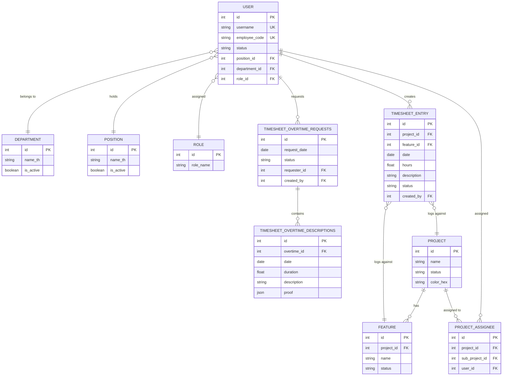

### 5.2 Database Tables

| Table Name                        | Description                     | Index Count |
| --------------------------------- | ------------------------------- | ----------- |
| `user`                            | User and employee data          | 4           |
| `departments`, `positions`        | Department and position data    | —           |
| `roles`, `permissions`            | Role and access permission data | —           |
| `project`, `feature`              | Project and feature data        | —           |
| `project_assignee`                | Project member assignments      | —           |
| `timesheet_entry`                 | Work-hour log entries           | 4           |
| `timesheet_overtime_requests`     | Overtime requests               | 3           |
| `timesheet_overtime_descriptions` | Overtime detail descriptions    | 2           |

---

## §6 · Data Flow Diagram

### 6.1 Timesheet Entry Flow

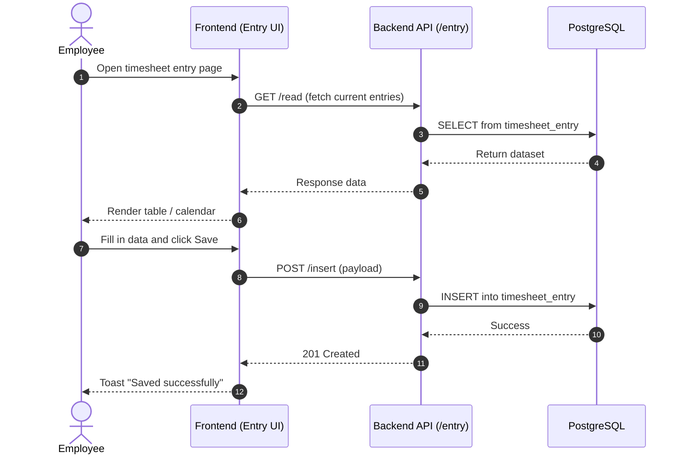

### 6.2 Overtime Request & Approval Flow

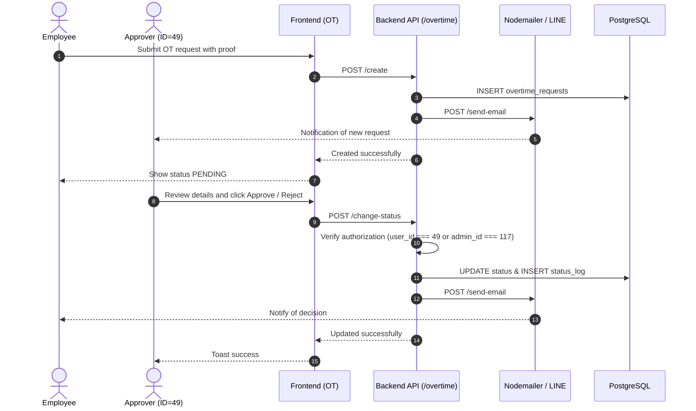

### 6.3 Export Flow

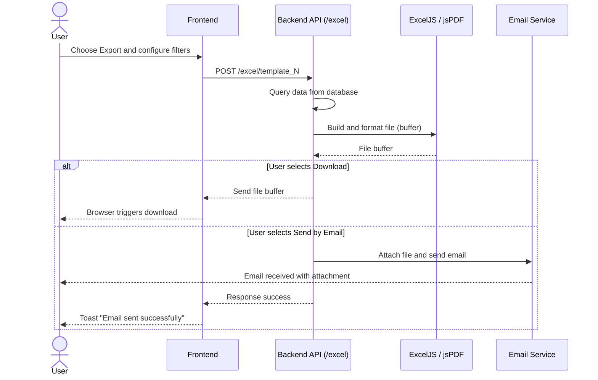

---

## §7 · Infrastructure Specification

### 7.1 Technology Stack Summary

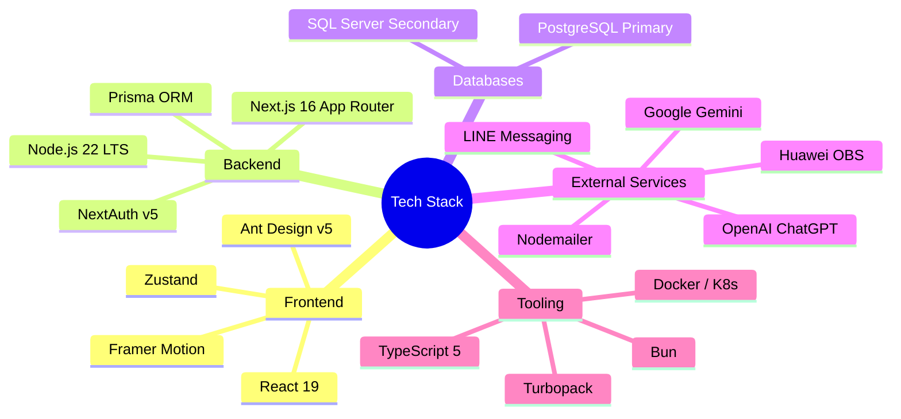

### 7.2 Application & Database Details

| Item                    | Details                                                |
| :---------------------- | :----------------------------------------------------- |
| **Framework / Runtime** | Next.js v16.2.4 (App Router) / Node.js 22.9.0 LTS      |
| **Primary Database**    | PostgreSQL (Timesheet Management DB) via Prisma v6.8.2 |
| **Secondary Database**  | Microsoft SQL Server (SchoolBright Main DB)            |
| **Package Manager**     | Bun                                                    |
| **Storage**             | Huawei OBS (esdk-obs-nodejs 3.26.2)                    |
| **Deployment Target**   | Kubernetes (Cloud-based / On-Premise Hybrid)           |

---

## §8 · Integration Map

### 8.1 System Integration Overview

**Diagram 8.1a — Frontend → Backend API**

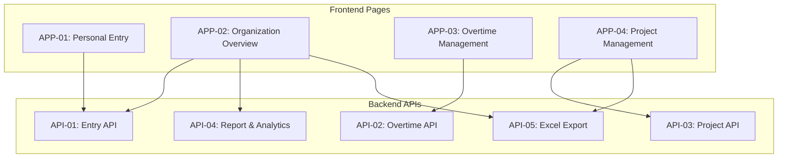

**Diagram 8.1b — Backend API → Database**

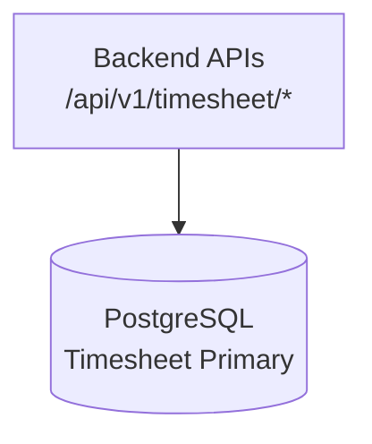

**Diagram 8.1c — Backend API → External Services**

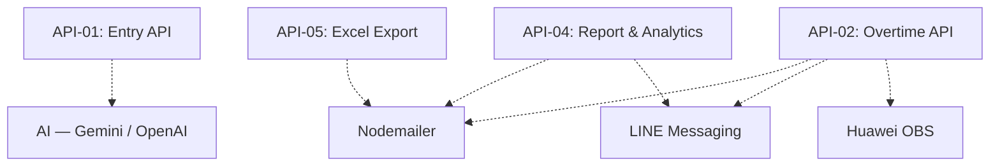

### 8.2 Authentication & Authorization Flow

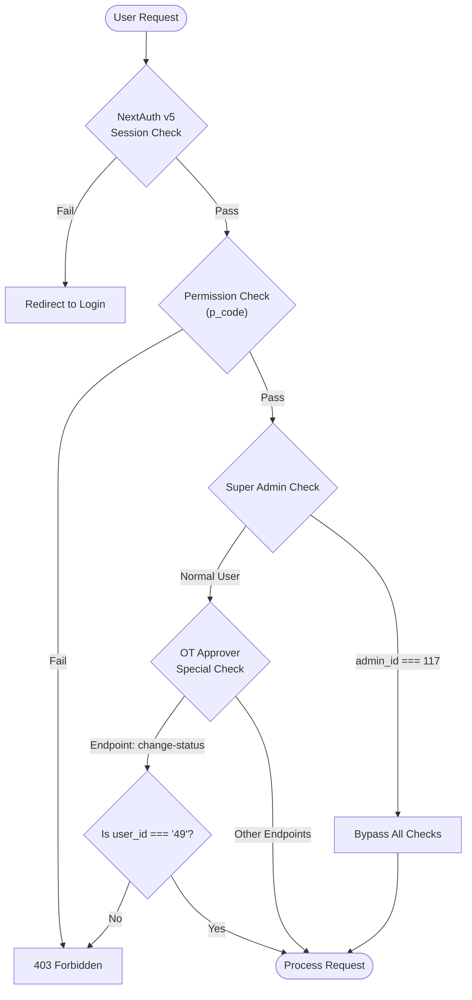

---

## Appendix

### A · Key Environment Variables

| Variable                              | Purpose                      | Sensitivity |
| ------------------------------------- | ---------------------------- | ----------- |
| `DATABASE_TIMESHEET_URL`              | PostgreSQL Connection String | CRITICAL    |
| `DATABASE_URL`                        | SQL Server Connection String | CRITICAL    |
| `NEXTAUTH_SECRET`                     | NextAuth Signing Key         | CRITICAL    |
| `GEMINI_API_KEY`                      | Google Gemini API Key        | SECRET      |
| `OPENAI_API_KEY`                      | OpenAI API Key               | SECRET      |
| `LINE_CHANNEL_ACCESS_TOKEN`           | LINE Messaging API Token     | SECRET      |
| `SMTP_HOST`, `SMTP_USER`, `SMTP_PASS` | Email Service Configuration  | SECRET      |
| `OBS_*`                               | Huawei OBS Storage Keys      | SECRET      |

---

> **Document Control**
>
> | Item             | Details                                               |
> | ---------------- | ----------------------------------------------------- |
> | Prepared by      | Senior Full-Stack Developer, SchoolBright             |
> | Prepared Date    | April 22, 2026                                        |
> | Document Version | 1.0.0                                                 |
> | Source Reference | Source Code v2.4.45, `prisma/timesheet/schema.prisma` |
> | Classification   | INTERNAL — FOR AUDITOR USE ONLY                       |
> | Related Document | `_doc/timesheet/application-list.md` (Thai version)   |

---

_This document is generated from the actual source code of the SchoolBright Timesheet Management System._
_All rights reserved — SchoolBright Co., Ltd._
