# แผนผังการเชื่อมต่อของเครื่องคอมพิวเตอร์และอุปกรณ์ที่เกี่ยวข้อง

## Network Diagram — ระบบบริหารจัดการเวลาทำงาน (Timesheet Management System)

> **Organization:** SchoolBright Co., Ltd.
> **System Scope:** Timesheet Management System (TMS) — เฉพาะระบบ Timesheet เท่านั้น
> **Document Version:** 2.4.45
> **Prepared Date:** 22 เมษายน พ.ศ. 2569
> **Classification:** INTERNAL — FOR AUDITOR USE ONLY

## สารบัญ (Table of Contents)

| หมวด | รายการ                                               |
| ---- | ---------------------------------------------------- |
| 1    | ภาพรวมโครงสร้างเครือข่าย (Network Topology Overview) |
| 2    | เครื่องผู้ใช้งาน (Client Devices)                    |
| 3    | ชั้น Application และ Web Server (Application Layer)  |
| 4    | ชั้นฐานข้อมูล (Database Layer)                       |
| 5    | บริการภายนอก (External Services)                     |
| 6    | เส้นทางการรับส่งข้อมูลหลัก (Data Flow Paths)         |
| 7    | การเข้ารหัสและความปลอดภัย (Security Boundary)        |

## 1. ภาพรวมโครงสร้างเครือข่าย (Network Topology Overview)

**Diagram 1.1 — ภาพรวมชั้นเครือข่ายทั้งหมด**

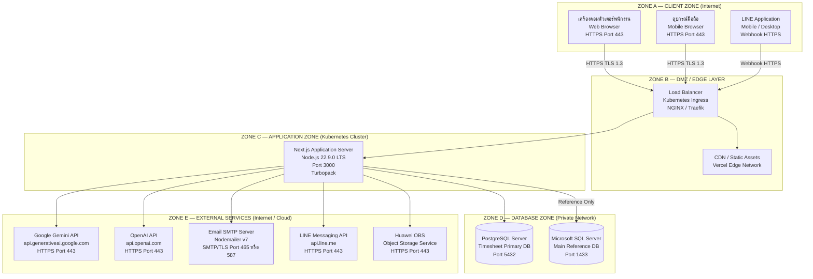
```mermaid
flowchart TD
    subgraph ZONE_CLIENT["ZONE A — CLIENT ZONE (Internet)"]
        C1["เครื่องคอมพิวเตอร์พนักงาน\nWeb Browser\nHTTPS Port 443"]
        C2["อุปกรณ์มือถือ\nMobile Browser\nHTTPS Port 443"]
        C3["LINE Application\nMobile / Desktop\nWebhook HTTPS"]
    end

    subgraph ZONE_DMZ["ZONE B — DMZ / EDGE LAYER"]
        LB["Load Balancer\nKubernetes Ingress\nNGINX / Traefik"]
        CDN["CDN / Static Assets\nVercel Edge Network"]
    end

    subgraph ZONE_APP["ZONE C — APPLICATION ZONE (Kubernetes Cluster)"]
        APP["Next.js Application Server\nNode.js 22.9.0 LTS\nPort 3000\nTurbopack"]
    end

    subgraph ZONE_DB["ZONE D — DATABASE ZONE (Private Network)"]
        PG[("PostgreSQL Server\nTimesheet Primary DB\nPort 5432")]
        SQL[("Microsoft SQL Server\nMain Reference DB\nPort 1433")]
    end

    subgraph ZONE_EXT["ZONE E — EXTERNAL SERVICES (Internet / Cloud)"]
        GEMINI["Google Gemini API\napi.generativeai.google.com\nHTTPS Port 443"]
        OPENAI["OpenAI API\napi.openai.com\nHTTPS Port 443"]
        SMTP["Email SMTP Server\nNodemailer v7\nSMTP/TLS Port 465 หรือ 587"]
        LINE["LINE Messaging API\napi.line.me\nHTTPS Port 443"]
        OBS["Huawei OBS\nObject Storage Service\nHTTPS Port 443"]
    end

    C1 -->|HTTPS TLS 1.3| LB
    C2 -->|HTTPS TLS 1.3| LB
    C3 -->|Webhook HTTPS| LB
    LB --> CDN
    LB --> APP
    APP --> PG
    APP -->|Reference Only| SQL
    APP --> GEMINI
    APP --> OPENAI
    APP --> SMTP
    APP --> LINE
    APP --> OBS
```

**Diagram 1.2 — Network Zone Summary**

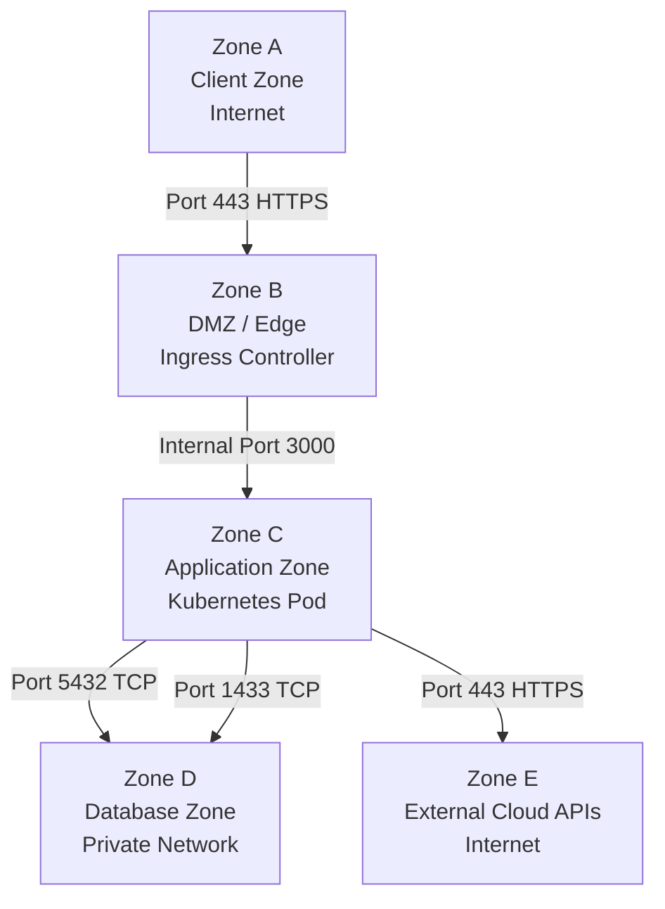
```mermaid
flowchart TD
    ZA["Zone A\nClient Zone\nInternet"]
    ZB["Zone B\nDMZ / Edge\nIngress Controller"]
    ZC["Zone C\nApplication Zone\nKubernetes Pod"]
    ZD["Zone D\nDatabase Zone\nPrivate Network"]
    ZE["Zone E\nExternal Cloud APIs\nInternet"]
    ZA -->|Port 443 HTTPS| ZB
    ZB -->|Internal Port 3000| ZC
    ZC -->|Port 5432 TCP| ZD
    ZC -->|Port 1433 TCP| ZD
    ZC -->|Port 443 HTTPS| ZE
```

## 2. เครื่องผู้ใช้งาน (Client Devices)

**Diagram 2.1 — ประเภทอุปกรณ์ผู้ใช้งาน**

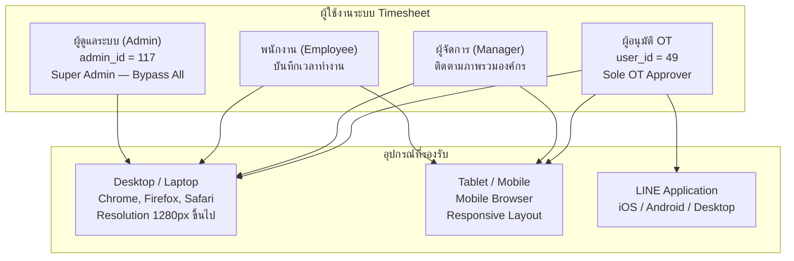
```mermaid
flowchart TD
    subgraph USERS["ผู้ใช้งานระบบ Timesheet"]
        U1["ผู้ดูแลระบบ (Admin)\nadmin_id = 117\nSuper Admin — Bypass All"]
        U2["พนักงาน (Employee)\nบันทึกเวลาทำงาน"]
        U3["ผู้จัดการ (Manager)\nติดตามภาพรวมองค์กร"]
        U4["ผู้อนุมัติ OT\nuser_id = 49\nSole OT Approver"]
    end

    subgraph DEVICES["อุปกรณ์ที่รองรับ"]
        D1["Desktop / Laptop\nChrome, Firefox, Safari\nResolution 1280px ขึ้นไป"]
        D2["Tablet / Mobile\nMobile Browser\nResponsive Layout"]
        D3["LINE Application\niOS / Android / Desktop"]
    end

    U1 --> D1
    U2 --> D1
    U2 --> D2
    U3 --> D1
    U3 --> D2
    U4 --> D1
    U4 --> D2
    U4 --> D3
```

**Diagram 2.2 — โปรโตคอลการเชื่อมต่อจาก Client**

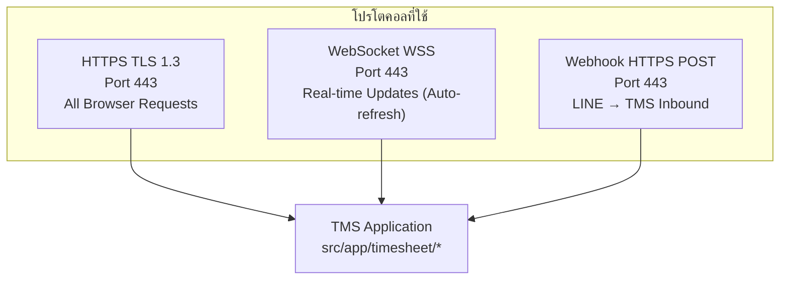
```mermaid
flowchart TD
    subgraph PROTOCOLS["โปรโตคอลที่ใช้"]
        P1["HTTPS TLS 1.3\nPort 443\nAll Browser Requests"]
        P2["WebSocket WSS\nPort 443\nReal-time Updates (Auto-refresh)"]
        P3["Webhook HTTPS POST\nPort 443\nLINE → TMS Inbound"]
    end
    TMS["TMS Application\nsrc/app/timesheet/*"]
    P1 --> TMS
    P2 --> TMS
    P3 --> TMS
```

## 3. ชั้น Application และ Web Server (Application Layer)

**Diagram 3.1 — โครงสร้าง Application Server**

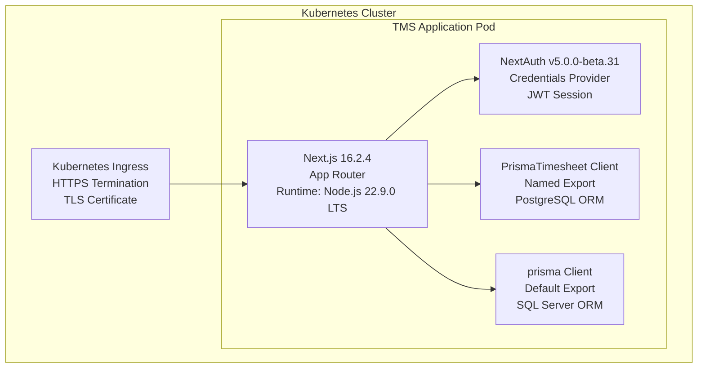
```mermaid
flowchart TD
    subgraph K8S["Kubernetes Cluster"]
        subgraph POD["TMS Application Pod"]
            NEXTJS["Next.js 16.2.4\nApp Router\nRuntime: Node.js 22.9.0 LTS"]
            AUTH["NextAuth v5.0.0-beta.31\nCredentials Provider\nJWT Session"]
            PRISMA_TS["PrismaTimesheet Client\nNamed Export\nPostgreSQL ORM"]
            PRISMA_MAIN["prisma Client\nDefault Export\nSQL Server ORM"]
        end
        INGRESS["Kubernetes Ingress\nHTTPS Termination\nTLS Certificate"]
    end
    INGRESS --> NEXTJS
    NEXTJS --> AUTH
    NEXTJS --> PRISMA_TS
    NEXTJS --> PRISMA_MAIN
```

**Diagram 3.2 — Frontend Pages (src/app/timesheet)**

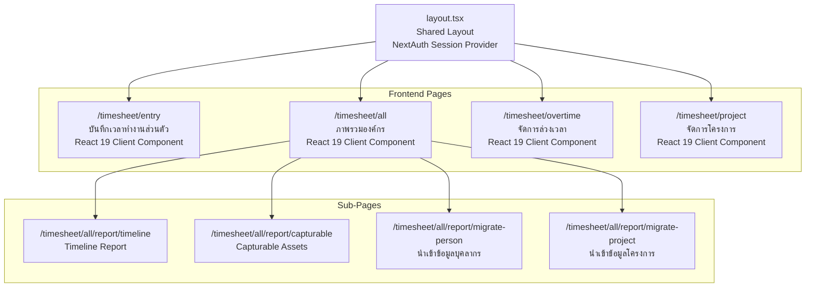
```mermaid
flowchart TD
    LAYOUT["layout.tsx\nShared Layout\nNextAuth Session Provider"]

    subgraph PAGES["Frontend Pages"]
        FE1["/timesheet/entry\nบันทึกเวลาทำงานส่วนตัว\nReact 19 Client Component"]
        FE2["/timesheet/all\nภาพรวมองค์กร\nReact 19 Client Component"]
        FE3["/timesheet/overtime\nจัดการล่วงเวลา\nReact 19 Client Component"]
        FE4["/timesheet/project\nจัดการโครงการ\nReact 19 Client Component"]
    end

    subgraph SUBPAGES["Sub-Pages"]
        SP1["/timesheet/all/report/timeline\nTimeline Report"]
        SP2["/timesheet/all/report/capturable\nCapturable Assets"]
        SP3["/timesheet/all/report/migrate-person\nนำเข้าข้อมูลบุคลากร"]
        SP4["/timesheet/all/report/migrate-project\nนำเข้าข้อมูลโครงการ"]
    end

    LAYOUT --> FE1
    LAYOUT --> FE2
    LAYOUT --> FE3
    LAYOUT --> FE4
    FE2 --> SP1
    FE2 --> SP2
    FE2 --> SP3
    FE2 --> SP4
```

**Diagram 3.3 — Backend API Routes (src/app/api/v1/timesheet)**

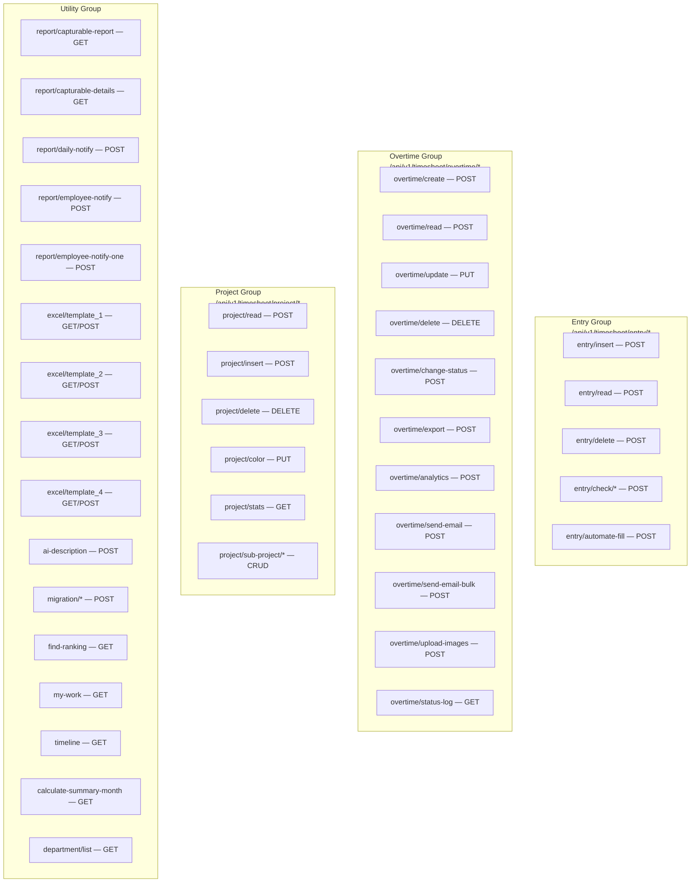
```mermaid
flowchart TD
    subgraph API_ENTRY["Entry Group\n/api/v1/timesheet/entry/*"]
        AE1["entry/insert — POST"]
        AE2["entry/read — POST"]
        AE3["entry/delete — POST"]
        AE4["entry/check/* — POST"]
        AE5["entry/automate-fill — POST"]
    end

    subgraph API_OT["Overtime Group\n/api/v1/timesheet/overtime/*"]
        AO1["overtime/create — POST"]
        AO2["overtime/read — POST"]
        AO3["overtime/update — PUT"]
        AO4["overtime/delete — DELETE"]
        AO5["overtime/change-status — POST"]
        AO6["overtime/export — POST"]
        AO7["overtime/analytics — POST"]
        AO8["overtime/send-email — POST"]
        AO9["overtime/send-email-bulk — POST"]
        AO10["overtime/upload-images — POST"]
        AO11["overtime/status-log — GET"]
    end

    subgraph API_PROJ["Project Group\n/api/v1/timesheet/project/*"]
        AP1["project/read — POST"]
        AP2["project/insert — POST"]
        AP3["project/delete — DELETE"]
        AP4["project/color — PUT"]
        AP5["project/stats — GET"]
        AP6["project/sub-project/* — CRUD"]
    end

    subgraph API_OTHER["Utility Group"]
        AU1["report/capturable-report — GET"]
        AU2["report/capturable-details — GET"]
        AU3["report/daily-notify — POST"]
        AU4["report/employee-notify — POST"]
        AU5["report/employee-notify-one — POST"]
        AU6["excel/template_1 — GET/POST"]
        AU7["excel/template_2 — GET/POST"]
        AU8["excel/template_3 — GET/POST"]
        AU9["excel/template_4 — GET/POST"]
        AU10["ai-description — POST"]
        AU11["migration/* — POST"]
        AU12["find-ranking — GET"]
        AU13["my-work — GET"]
        AU14["timeline — GET"]
        AU15["calculate-summary-month — GET"]
        AU16["department/list — GET"]
    end
```

## 4. ชั้นฐานข้อมูล (Database Layer)

**Diagram 4.1 — Database Connection Architecture**

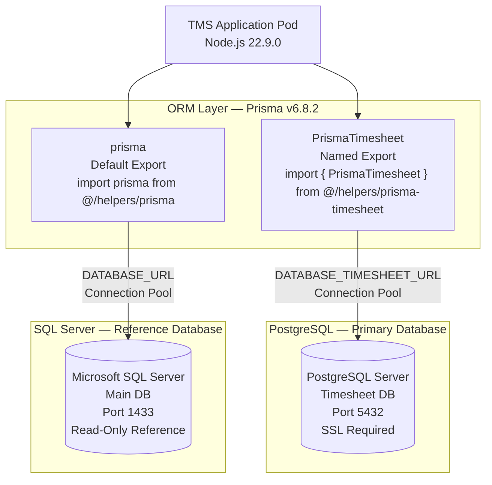
```mermaid
flowchart TD
    APP["TMS Application Pod\nNode.js 22.9.0"]

    subgraph ORM["ORM Layer — Prisma v6.8.2"]
        ORM1["PrismaTimesheet\nNamed Export\nimport { PrismaTimesheet } from @/helpers/prisma-timesheet"]
        ORM2["prisma\nDefault Export\nimport prisma from @/helpers/prisma"]
    end

    subgraph DB_PG["PostgreSQL — Primary Database"]
        PG[("PostgreSQL Server\nTimesheet DB\nPort 5432\nSSL Required")]
    end

    subgraph DB_SQL["SQL Server — Reference Database"]
        SQL[("Microsoft SQL Server\nMain DB\nPort 1433\nRead-Only Reference")]
    end

    APP --> ORM1
    APP --> ORM2
    ORM1 -->|DATABASE_TIMESHEET_URL\nConnection Pool| PG
    ORM2 -->|DATABASE_URL\nConnection Pool| SQL
```

**Diagram 4.2 — ตารางฐานข้อมูล PostgreSQL (Timesheet DB)**

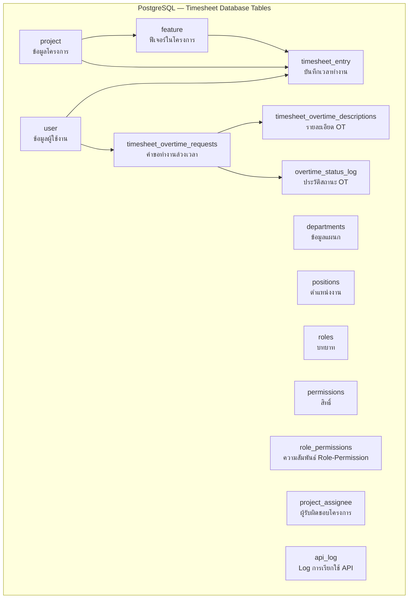
```mermaid
flowchart TD
    subgraph PG_TABLES["PostgreSQL — Timesheet Database Tables"]
        T1["user\nข้อมูลผู้ใช้งาน"]
        T2["departments\nข้อมูลแผนก"]
        T3["positions\nตำแหน่งงาน"]
        T4["roles\nบทบาท"]
        T5["permissions\nสิทธิ์"]
        T6["role_permissions\nความสัมพันธ์ Role-Permission"]
        T7["project\nข้อมูลโครงการ"]
        T8["feature\nฟีเจอร์ในโครงการ"]
        T9["project_assignee\nผู้รับผิดชอบโครงการ"]
        T10["timesheet_entry\nบันทึกเวลาทำงาน"]
        T11["timesheet_overtime_requests\nคำขอทำงานล่วงเวลา"]
        T12["timesheet_overtime_descriptions\nรายละเอียด OT"]
        T13["overtime_status_log\nประวัติสถานะ OT"]
        T14["api_log\nLog การเรียกใช้ API"]
    end

    T1 --> T10
    T1 --> T11
    T7 --> T10
    T8 --> T10
    T7 --> T8
    T11 --> T12
    T11 --> T13
```

**Diagram 4.3 — SQL Server Reference (Main DB)**

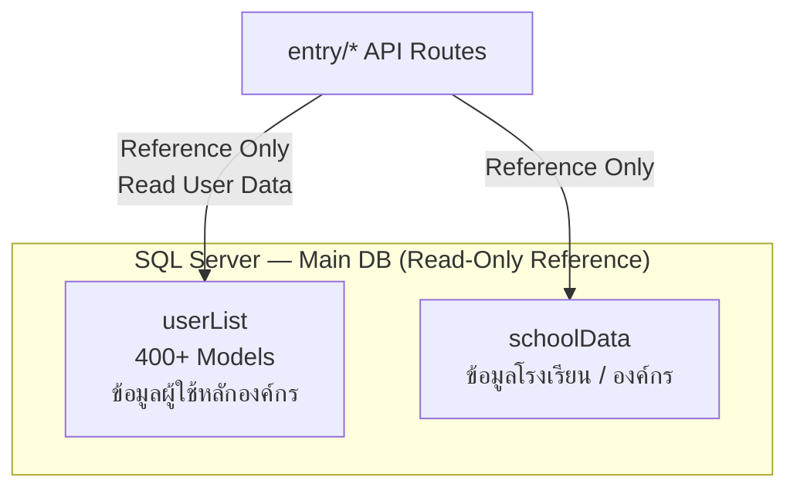
```mermaid
flowchart TD
    subgraph SQL_REF["SQL Server — Main DB (Read-Only Reference)"]
        M1["userList\n400+ Models\nข้อมูลผู้ใช้หลักองค์กร"]
        M2["schoolData\nข้อมูลโรงเรียน / องค์กร"]
    end
    API_ENTRY["entry/* API Routes"]
    API_ENTRY -->|Reference Only\nRead User Data| M1
    API_ENTRY -->|Reference Only| M2
```

## 5. บริการภายนอก (External Services)

**Diagram 5.1 — External Service Connections**

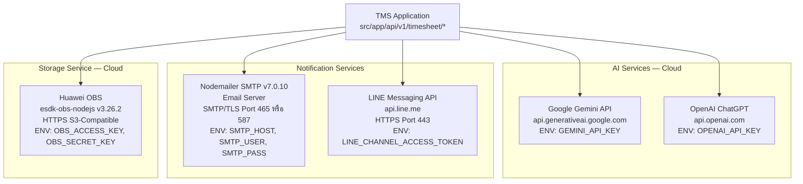
```mermaid
flowchart TD
    TMS["TMS Application\nsrc/app/api/v1/timesheet/*"]

    subgraph AI["AI Services — Cloud"]
        AI1["Google Gemini API\napi.generativeai.google.com\nENV: GEMINI_API_KEY"]
        AI2["OpenAI ChatGPT\napi.openai.com\nENV: OPENAI_API_KEY"]
    end

    subgraph NOTIFY["Notification Services"]
        SMTP["Nodemailer SMTP v7.0.10\nEmail Server\nSMTP/TLS Port 465 หรือ 587\nENV: SMTP_HOST, SMTP_USER, SMTP_PASS"]
        LINE["LINE Messaging API\napi.line.me\nHTTPS Port 443\nENV: LINE_CHANNEL_ACCESS_TOKEN"]
    end

    subgraph STORAGE["Storage Service — Cloud"]
        OBS["Huawei OBS\nesdk-obs-nodejs v3.26.2\nHTTPS S3-Compatible\nENV: OBS_ACCESS_KEY, OBS_SECRET_KEY"]
    end

    TMS --> AI1
    TMS --> AI2
    TMS --> SMTP
    TMS --> LINE
    TMS --> OBS
```

**Diagram 5.2 — Trigger Map: API → External Services**

```mermaid
flowchart TD
    subgraph TRIGGERS_AI["AI Triggers"]
        T_AI1["entry/automate-fill\nAI กรอกข้อมูลอัตโนมัติ"]
        T_AI2["ai-description\nสร้างคำอธิบายงาน"]
        T_AI3["migration/automate-fill\nนำเข้าพร้อม AI"]
    end

    subgraph TRIGGERS_SMTP["SMTP Triggers"]
        T_SM1["overtime/create\nแจ้งผู้อนุมัติ OT"]
        T_SM2["overtime/change-status\nแจ้งผลการอนุมัติ"]
        T_SM3["overtime/send-email-bulk\nแจ้งเตือนหมู่"]
        T_SM4["report/daily-notify\nรายงานรายวัน"]
        T_SM5["report/employee-notify\nแจ้งพนักงานหมู่"]
        T_SM6["excel/template_4/send-email\nส่ง Excel ทาง Email"]
    end

    subgraph TRIGGERS_OBS["OBS Triggers"]
        T_OB1["overtime/upload-images\nอัปโหลดรูปหลักฐาน OT"]
    end

    GEM["Google Gemini API"]
    GPT["OpenAI API"]
    SMTP_SVC["Nodemailer SMTP"]
    OBS_SVC["Huawei OBS"]

    T_AI1 --> GEM
    T_AI1 --> GPT
    T_AI2 --> GEM
    T_AI3 --> GEM
    T_SM1 --> SMTP_SVC
    T_SM2 --> SMTP_SVC
    T_SM3 --> SMTP_SVC
    T_SM4 --> SMTP_SVC
    T_SM5 --> SMTP_SVC
    T_SM6 --> SMTP_SVC
    T_OB1 --> OBS_SVC
```

## 6. เส้นทางการรับส่งข้อมูลหลัก (Data Flow Paths)

**Diagram 6.1 — เส้นทางบันทึกเวลาทำงาน (Timesheet Entry)**

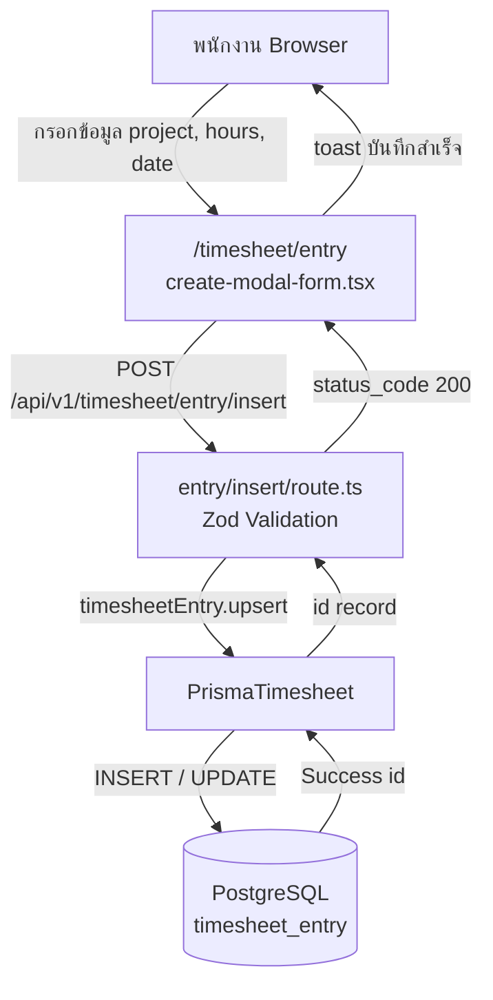
```mermaid
flowchart TD
    U["พนักงาน Browser"]
    FE["/timesheet/entry\ncreate-modal-form.tsx"]
    API["entry/insert/route.ts\nZod Validation"]
    ORM["PrismaTimesheet"]
    PG[("PostgreSQL\ntimesheet_entry")]

    U -->|กรอกข้อมูล project, hours, date| FE
    FE -->|POST /api/v1/timesheet/entry/insert| API
    API -->|timesheetEntry.upsert| ORM
    ORM -->|INSERT / UPDATE| PG
    PG -->|Success id| ORM
    ORM -->|id record| API
    API -->|status_code 200| FE
    FE -->|toast บันทึกสำเร็จ| U
```

**Diagram 6.2 — เส้นทางยื่นขอทำงานล่วงเวลา (OT Create)**

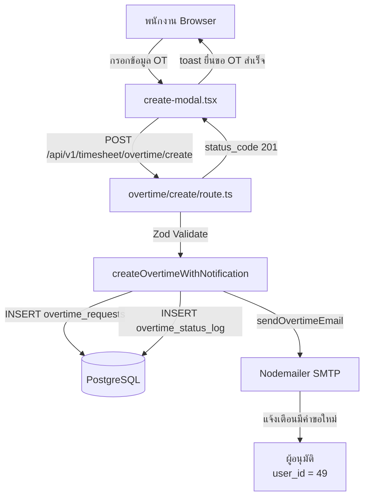
```mermaid
flowchart TD
    U["พนักงาน Browser"]
    FE["create-modal.tsx"]
    API["overtime/create/route.ts"]
    SVC["createOvertimeWithNotification"]
    PG[("PostgreSQL")]
    SMTP["Nodemailer SMTP"]
    APPROVER["ผู้อนุมัติ\nuser_id = 49"]

    U -->|กรอกข้อมูล OT| FE
    FE -->|POST /api/v1/timesheet/overtime/create| API
    API -->|Zod Validate| SVC
    SVC -->|INSERT overtime_requests| PG
    SVC -->|INSERT overtime_status_log| PG
    SVC -->|sendOvertimeEmail| SMTP
    SMTP -->|แจ้งเตือนมีคำขอใหม่| APPROVER
    API -->|status_code 201| FE
    FE -->|toast ยื่นขอ OT สำเร็จ| U
```

**Diagram 6.3 — เส้นทางอนุมัติ OT (OT Change Status)**

```mermaid
flowchart TD
    APPROVER["ผู้อนุมัติ\nuser_id = 49 หรือ admin_id = 117"]
    FE["batch-status-modal.tsx"]
    API["overtime/change-status/route.ts"]
    AUTH["NextAuth auth()\nSession Verify"]
    PG[("PostgreSQL")]
    SMTP["Nodemailer SMTP"]
    REQUESTER["ผู้ยื่นขอ OT"]

    APPROVER -->|กด อนุมัติ หรือ ปฏิเสธ| FE
    FE -->|POST /api/v1/timesheet/overtime/change-status| API
    API -->|await auth()| AUTH
    AUTH -->|session.user.id, admin_id| API
    API -->|ตรวจสอบ user_id = 49 หรือ admin_id = 117| API
    API -->|UPDATE overtime.status| PG
    API -->|INSERT overtime_status_log| PG
    API -->|sendOvertimeEmail| SMTP
    SMTP -->|แจ้งผลการพิจารณา| REQUESTER
    API -->|status_code 200| FE
    FE -->|toast เปลี่ยนสถานะสำเร็จ| APPROVER
```

**Diagram 6.4 — เส้นทาง AI Auto-Fill**

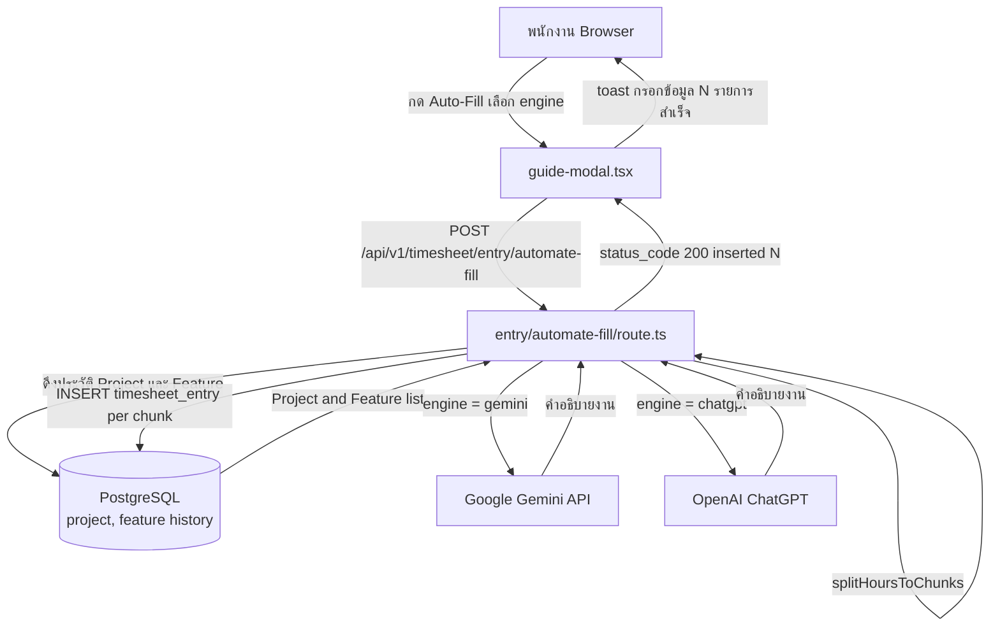
```mermaid
flowchart TD
    U["พนักงาน Browser"]
    FE["guide-modal.tsx"]
    API["entry/automate-fill/route.ts"]
    PG[("PostgreSQL\nproject, feature history")]
    GEM["Google Gemini API"]
    GPT["OpenAI ChatGPT"]

    U -->|กด Auto-Fill เลือก engine| FE
    FE -->|POST /api/v1/timesheet/entry/automate-fill| API
    API -->|splitHoursToChunks| API
    API -->|ดึงประวัติ Project และ Feature| PG
    PG -->|Project and Feature list| API
    API -->|engine = gemini| GEM
    API -->|engine = chatgpt| GPT
    GEM -->|คำอธิบายงาน| API
    GPT -->|คำอธิบายงาน| API
    API -->|INSERT timesheet_entry per chunk| PG
    API -->|status_code 200 inserted N| FE
    FE -->|toast กรอกข้อมูล N รายการสำเร็จ| U
```

**Diagram 6.5 — เส้นทาง Export Excel**

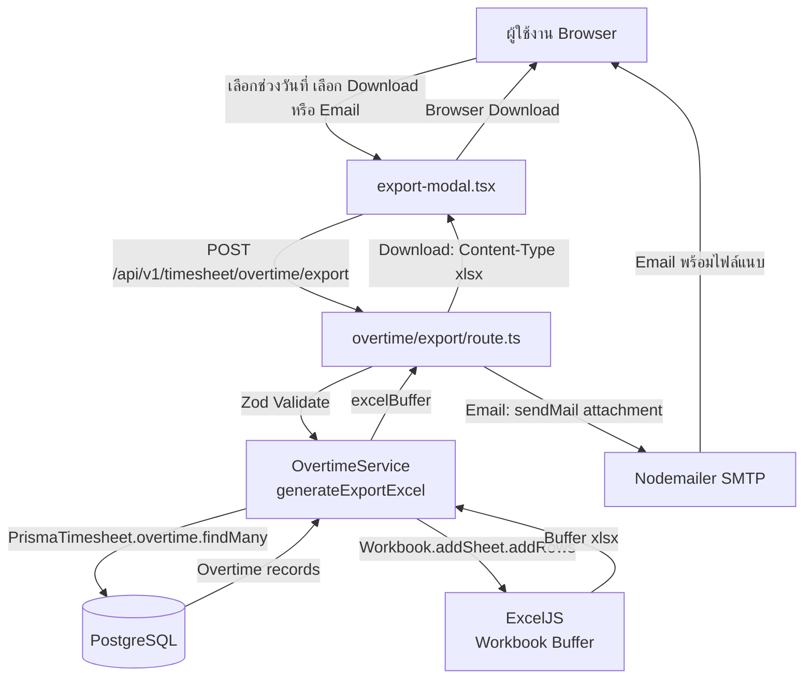
```mermaid
flowchart TD
    U["ผู้ใช้งาน Browser"]
    FE["export-modal.tsx"]
    API["overtime/export/route.ts"]
    SVC["OvertimeService\ngenerateExportExcel"]
    PG[("PostgreSQL")]
    XLS["ExcelJS\nWorkbook Buffer"]
    SMTP["Nodemailer SMTP"]

    U -->|เลือกช่วงวันที่ เลือก Download หรือ Email| FE
    FE -->|POST /api/v1/timesheet/overtime/export| API
    API -->|Zod Validate| SVC
    SVC -->|PrismaTimesheet.overtime.findMany| PG
    PG -->|Overtime records| SVC
    SVC -->|Workbook.addSheet.addRows| XLS
    XLS -->|Buffer xlsx| SVC
    SVC -->|excelBuffer| API
    API -->|Download: Content-Type xlsx| FE
    API -->|Email: sendMail attachment| SMTP
    FE -->|Browser Download| U
    SMTP -->|Email พร้อมไฟล์แนบ| U
```

**Diagram 6.6 — เส้นทาง OT Image Upload (Proof of Work)**

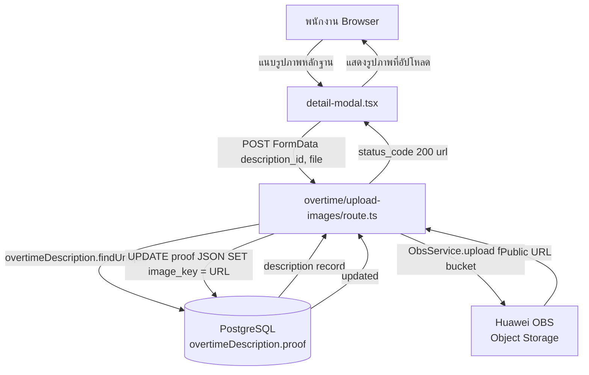
```mermaid
flowchart TD
    U["พนักงาน Browser"]
    FE["detail-modal.tsx"]
    API["overtime/upload-images/route.ts"]
    PG[("PostgreSQL\novertimeDescription.proof")]
    OBS["Huawei OBS\nObject Storage"]

    U -->|แนบรูปภาพหลักฐาน| FE
    FE -->|POST FormData description_id, file| API
    API -->|overtimeDescription.findUnique| PG
    PG -->|description record| API
    API -->|ObsService.upload file bucket| OBS
    OBS -->|Public URL| API
    API -->|UPDATE proof JSON SET image_key = URL| PG
    PG -->|updated| API
    API -->|status_code 200 url| FE
    FE -->|แสดงรูปภาพที่อัปโหลด| U
```

## 7. การเข้ารหัสและความปลอดภัย (Security Boundary)

**Diagram 7.1 — Authentication Flow**

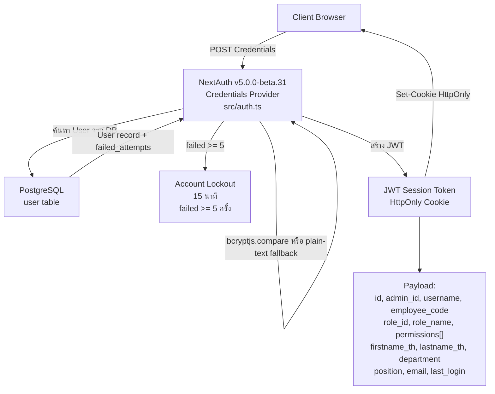
```mermaid
flowchart TD
    CLIENT["Client Browser"]
    NEXTAUTH["NextAuth v5.0.0-beta.31\nCredentials Provider\nsrc/auth.ts"]
    DB_USER["PostgreSQL\nuser table"]
    LOCKOUT["Account Lockout\n15 นาที\nfailed >= 5 ครั้ง"]
    JWT["JWT Session Token\nHttpOnly Cookie"]
    PAYLOAD["Payload:\nid, admin_id, username, employee_code\nrole_id, role_name, permissions[]\nfirstname_th, lastname_th, department\nposition, email, last_login"]

    CLIENT -->|POST Credentials| NEXTAUTH
    NEXTAUTH -->|ค้นหา User จาก DB| DB_USER
    DB_USER -->|User record + failed_attempts| NEXTAUTH
    NEXTAUTH -->|failed >= 5| LOCKOUT
    NEXTAUTH -->|bcryptjs.compare หรือ plain-text fallback| NEXTAUTH
    NEXTAUTH -->|สร้าง JWT| JWT
    JWT -->|Set-Cookie HttpOnly| CLIENT
    JWT --> PAYLOAD
```

**Diagram 7.2 — Authorization & Permission Check**

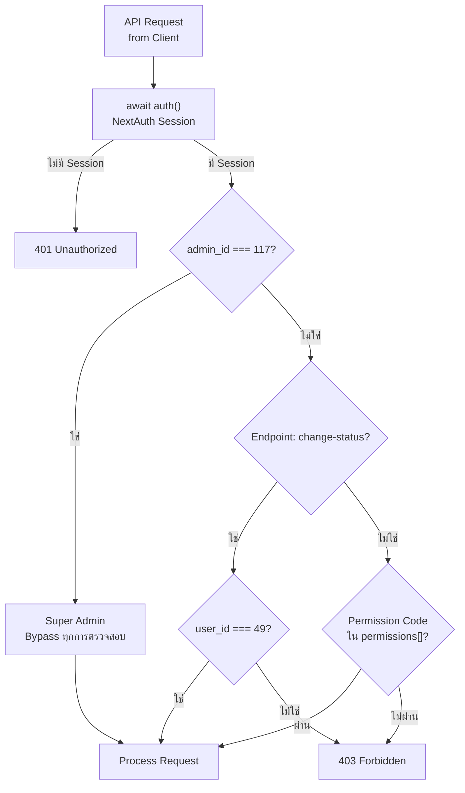
```mermaid
flowchart TD
    REQ["API Request\nfrom Client"]
    AUTH_CHECK["await auth()\nNextAuth Session"]
    NO_SESSION["401 Unauthorized"]
    SUPER_ADMIN{"admin_id === 117?"}
    BYPASS["Super Admin\nBypass ทุกการตรวจสอบ"]
    OT_CHECK{"Endpoint: change-status?"}
    USER49{"user_id === 49?"}
    PERM_CHECK{"Permission Code\nใน permissions[]?"}
    ALLOW["Process Request"]
    DENY["403 Forbidden"]

    REQ --> AUTH_CHECK
    AUTH_CHECK -->|ไม่มี Session| NO_SESSION
    AUTH_CHECK -->|มี Session| SUPER_ADMIN
    SUPER_ADMIN -->|ใช่| BYPASS
    SUPER_ADMIN -->|ไม่ใช่| OT_CHECK
    OT_CHECK -->|ใช่| USER49
    OT_CHECK -->|ไม่ใช่| PERM_CHECK
    USER49 -->|ใช่| ALLOW
    USER49 -->|ไม่ใช่| DENY
    PERM_CHECK -->|ผ่าน| ALLOW
    PERM_CHECK -->|ไม่ผ่าน| DENY
    BYPASS --> ALLOW
```

**Diagram 7.3 — Port และ Protocol Summary**

```mermaid
flowchart TD
    subgraph INBOUND["Inbound Traffic (เข้าสู่ระบบ)"]
        I1["Port 443 HTTPS TLS 1.3\nจาก Browser → Ingress"]
        I2["Port 443 HTTPS\nLINE Webhook → Ingress"]
    end

    subgraph INTERNAL["Internal Traffic (ภายใน Cluster)"]
        N1["Port 3000 HTTP\nIngress → Next.js Pod"]
    end

    subgraph OUTBOUND_DB["Outbound Database (ออกสู่ DB Zone)"]
        O1["Port 5432 TCP SSL\nNext.js Pod → PostgreSQL"]
        O2["Port 1433 TCP TLS\nNext.js Pod → SQL Server"]
    end

    subgraph OUTBOUND_EXT["Outbound External (ออกสู่ Internet)"]
        E1["Port 443 HTTPS\nNext.js → Google Gemini API"]
        E2["Port 443 HTTPS\nNext.js → OpenAI API"]
        E3["Port 465 หรือ 587 SMTP/TLS\nNext.js → Email Server"]
        E4["Port 443 HTTPS\nNext.js → LINE Messaging API"]
        E5["Port 443 HTTPS\nNext.js → Huawei OBS"]
    end

    INBOUND --> INTERNAL
    INTERNAL --> OUTBOUND_DB
    INTERNAL --> OUTBOUND_EXT
```

**Diagram 7.4 — Environment Variables (Security Classification)**

```mermaid
flowchart TD
    subgraph CRITICAL["CRITICAL — Database Credentials"]
        ENV1["DATABASE_TIMESHEET_URL\nPostgreSQL Connection String"]
        ENV2["DATABASE_URL\nSQL Server Connection String"]
        ENV3["NEXTAUTH_SECRET\nNextAuth JWT Signing Key"]
    end

    subgraph SECRET["SECRET — External Service Keys"]
        ENV4["GEMINI_API_KEY\nGoogle Gemini API"]
        ENV5["OPENAI_API_KEY\nOpenAI ChatGPT"]
        ENV6["LINE_CHANNEL_ACCESS_TOKEN\nLINE Messaging API"]
        ENV7["SMTP_HOST, SMTP_USER, SMTP_PASS\nEmail Service"]
        ENV8["OBS_ACCESS_KEY, OBS_SECRET_KEY\nHuawei OBS Storage"]
    end

    APP["TMS Application\nsrc/app/api/v1/timesheet/*"]
    APP --> CRITICAL
    APP --> SECRET
```

> **Document Control**
>
> | รายการ              | รายละเอียด                                                                                           |
> | ------------------- | ---------------------------------------------------------------------------------------------------- |
> | ผู้จัดทำ            | Senior Full-Stack Developer, SchoolBright                                                            |
> | วันที่จัดทำ         | 22 เมษายน พ.ศ. 2569                                                                                  |
> | เวอร์ชันเอกสาร      | 1.0.0                                                                                                |
> | อ้างอิงจาก          | Source Code v2.4.45, prisma/timesheet/schema.prisma, src/app/api/v1/timesheet/_, src/app/timesheet/_ |
> | ระดับความลับ        | INTERNAL — FOR AUDITOR USE ONLY                                                                      |
> | เอกสารที่เกี่ยวข้อง | application-list.md, application-interface-diagram.md                                                |

_เอกสารนี้สร้างจาก Source Code จริงของระบบ SchoolBright Timesheet Management System_
_สงวนสิทธิ์ — SchoolBright Co., Ltd._
