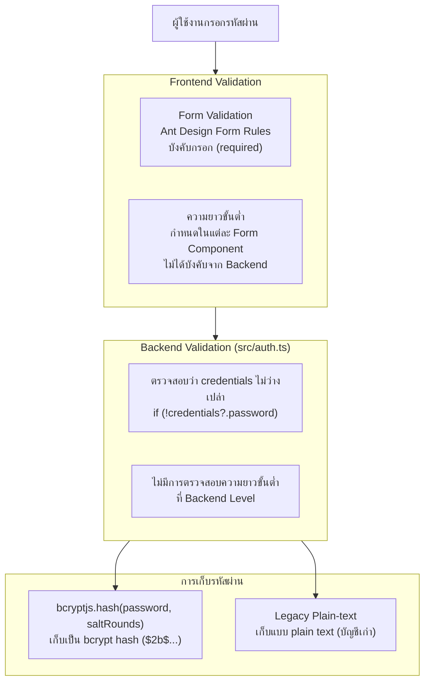
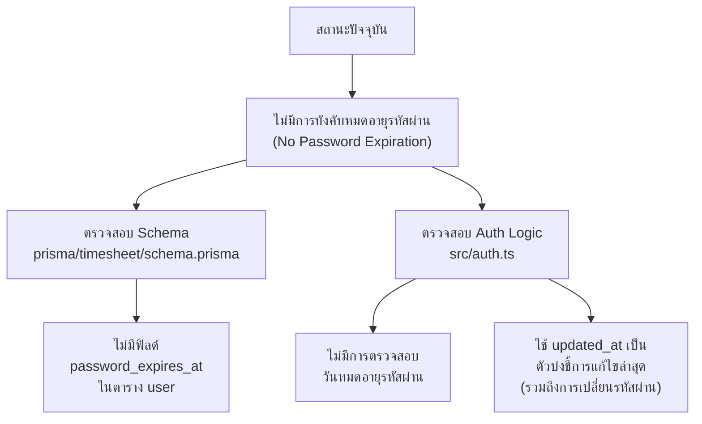
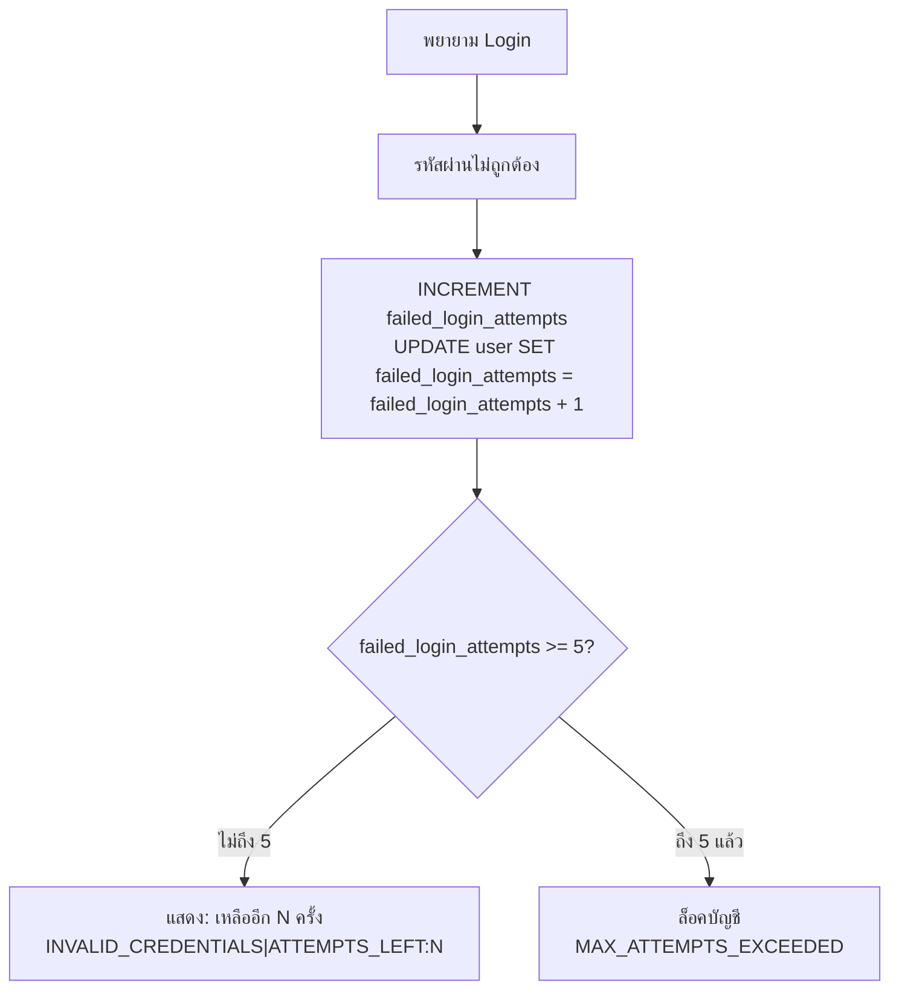
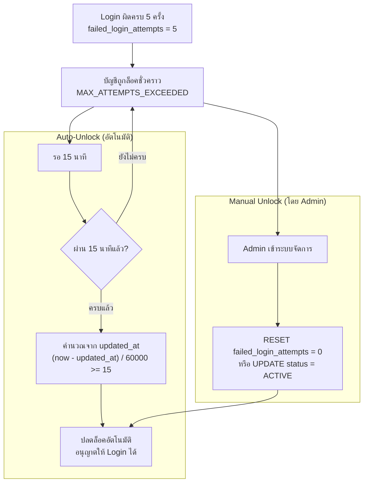
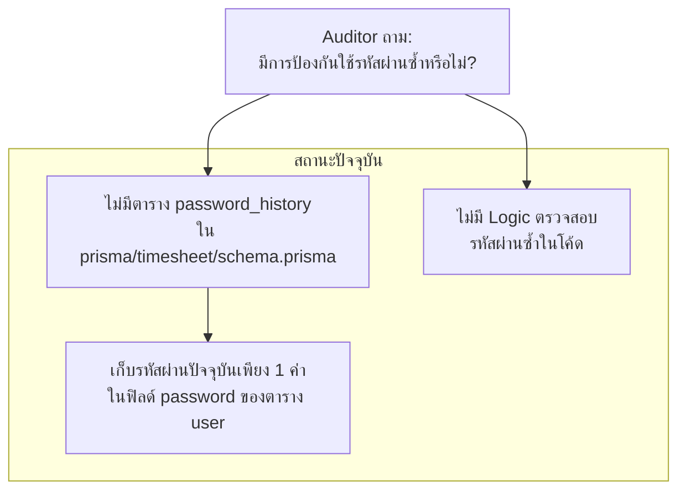
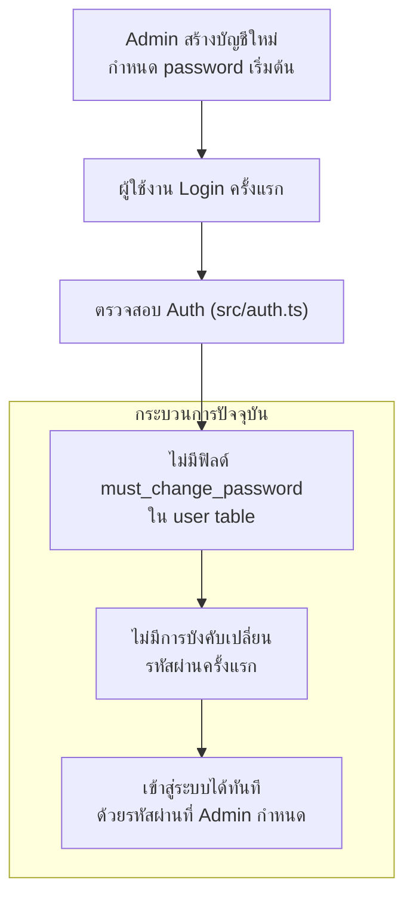
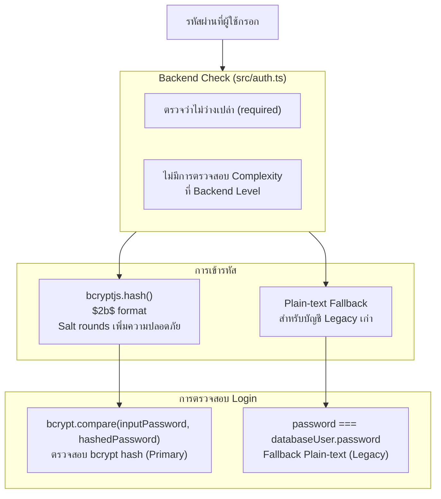
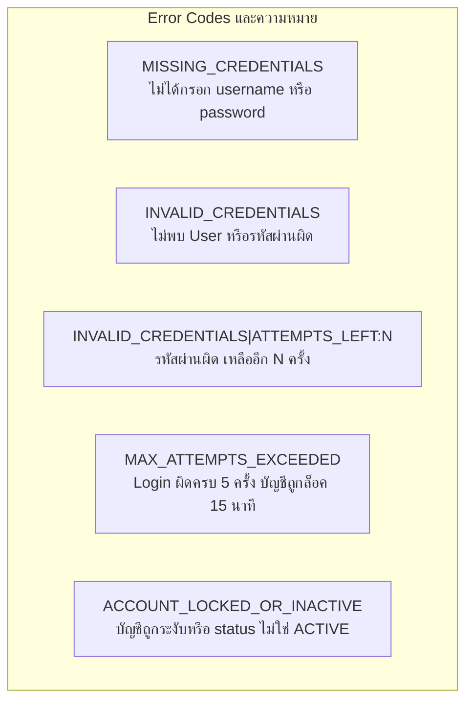

# หน้าจอค่าพารามิเตอร์รหัสผ่าน (Password Parameter Setting)

## ระบบบริหารจัดการเวลาทำงาน — Timesheet Management System

> **Organization:** SchoolBright Co., Ltd.
> **System Scope:** Timesheet Management System (TMS) — เฉพาะระบบ Timesheet เท่านั้น
> **Document Version:** 2.4.45
> **Prepared Date:** 22 เมษายน พ.ศ. 2569
> **Classification:** INTERNAL — FOR AUDITOR USE ONLY

## สารบัญ (Table of Contents)

| หมวด | รายการ                                                            |
| ---- | ----------------------------------------------------------------- |
| 1    | สรุปค่าพารามิเตอร์รหัสผ่านทั้งหมด (Parameter Summary)             |
| 2    | ความยาวขั้นต่ำของรหัสผ่าน (Minimum Password Length)               |
| 3    | อายุของรหัสผ่าน (Password Expiration Interval)                    |
| 4    | จำนวนครั้งที่ยอมให้ Login ผิด (Logon Attempt Limit)               |
| 5    | การปลดล็อคบัญชี (Account Unlock Policy)                           |
| 6    | ประวัติรหัสผ่าน (Password History)                                |
| 7    | การบังคับเปลี่ยนรหัสผ่านครั้งแรก (Forced Change at First Sign-On) |
| 8    | ความซับซ้อนของรหัสผ่าน (Password Complexity)                      |
| 9    | ขั้นตอน Authentication ฉบับสมบูรณ์ (Full Auth Flow)               |

## 1. สรุปค่าพารามิเตอร์รหัสผ่านทั้งหมด (Parameter Summary)

| พารามิเตอร์                                         | ค่าที่กำหนด                                           | ที่มาในโค้ด                                      |
| --------------------------------------------------- | ----------------------------------------------------- | ------------------------------------------------ |
| ความยาวขั้นต่ำ (Minimum Length)                     | ไม่บังคับโดยระบบปัจจุบัน (Application Level)          | `src/auth.ts` — ไม่มี validator length           |
| อายุรหัสผ่าน (Expiration Interval)                  | ไม่มีการบังคับหมดอายุ (No Expiry)                     | ไม่มี `password_expires_at` field ใน schema      |
| จำนวนครั้ง Login ผิดสูงสุด (Max Attempts)           | **5 ครั้ง**                                           | `const MAX_FAILED_ATTEMPTS = 5` ใน `src/auth.ts` |
| ระยะเวลาล็อคบัญชี (Lockout Duration)                | **15 นาที** จากนั้น Auto-unlock                       | `const LOCKOUT_MINUTES = 15` ใน `src/auth.ts`    |
| วิธีปลดล็อค (Unlock Method)                         | **อัตโนมัติ** หลังครบ 15 นาที                         | ตรวจจากเวลา `updated_at` ใน `src/auth.ts`        |
| ประวัติรหัสผ่าน (Password History)                  | ไม่มีการบันทึกประวัติ (No History Table)              | ไม่มีตาราง `password_history` ใน schema          |
| บังคับเปลี่ยนครั้งแรก (Force Change at First Login) | ไม่มีการบังคับ (Not Enforced)                         | ไม่มี `must_change_password` field ใน schema     |
| ความซับซ้อน (Complexity)                            | ไม่บังคับโดยระบบ Backend                              | ไม่มี Zod validator complexity                   |
| อัลกอริทึมเข้ารหัส (Hash Algorithm)                 | **bcryptjs** (primary) + plain-text fallback (legacy) | `bcrypt.compare()` ใน `src/auth.ts`              |

## 2. ความยาวขั้นต่ำของรหัสผ่าน (Minimum Password Length)

**Diagram 2.1 — การตรวจสอบรหัสผ่าน ณ จุดต่างๆ**



| รายการ                  | ค่าปัจจุบัน           | คำแนะนำ                                   |
| ----------------------- | --------------------- | ----------------------------------------- |
| ความยาวขั้นต่ำ Backend  | ไม่ได้กำหนด           | ควรเพิ่ม Zod validation >= 8 ตัวอักษร     |
| ความยาวขั้นต่ำ Frontend | ขึ้นอยู่กับแต่ละ Form | ควร Centralize เป็น constant เดียว        |
| อัลกอริทึม Hash         | bcryptjs (primary)    | ปลอดภัย — ใช้ salt rounds ทำให้ crack ยาก |
| Legacy Plain-text       | มีในระบบ (บัญชีเก่า)  | ควรบังคับ migrate เป็น bcrypt ทั้งหมด     |

## 3. อายุของรหัสผ่าน (Password Expiration Interval)

**Diagram 3.1 — โครงสร้างการจัดการอายุรหัสผ่าน**



| รายการ                      | ค่าปัจจุบัน                                  |
| --------------------------- | -------------------------------------------- |
| Password Expiration         | ไม่มี (Not configured)                       |
| ฟิลด์ติดตาม                 | `updated_at` — อัปเดตทุกครั้งที่แก้ไข record |
| วันที่เปลี่ยนรหัสผ่านล่าสุด | ใช้ `updated_at` เป็นตัวแทน                  |

## 4. จำนวนครั้งที่ยอมให้ Login ผิด (Logon Attempt Limit)

**Diagram 4.1 — กลไก Failed Login Attempt**



| รายการ                          | ค่า                                     | ที่มาในโค้ด                     |
| ------------------------------- | --------------------------------------- | ------------------------------- |
| จำนวนครั้งสูงสุด (Max Attempts) | **5 ครั้ง**                             | `const MAX_FAILED_ATTEMPTS = 5` |
| การแจ้งเตือนที่เหลือ            | แสดงจำนวนครั้งที่เหลือ                  | `ATTEMPTS_LEFT:${remaining}`    |
| ฟิลด์บันทึก                     | `failed_login_attempts` (INT DEFAULT 0) | `user` table                    |
| Reset เมื่อ                     | Login สำเร็จ                            | `failed_login_attempts: 0`      |

## 5. การปลดล็อคบัญชี (Account Unlock Policy)

**Diagram 5.1 — กระบวนการล็อคและปลดล็อคบัญชี**



| รายการ          | ค่า                                         | ที่มาในโค้ด                         |
| --------------- | ------------------------------------------- | ----------------------------------- |
| วิธีปลดล็อคหลัก | **Auto-unlock อัตโนมัติ** หลัง 15 นาที      | `diffInMinutes < LOCKOUT_MINUTES`   |
| ระยะเวลาล็อค    | **15 นาที**                                 | `const LOCKOUT_MINUTES = 15`        |
| วิธีคำนวณเวลา   | เปรียบเทียบ `updated_at` กับเวลาปัจจุบัน    | `(now - lastAttempt) / (1000 * 60)` |
| Admin ปลดล็อค   | ได้ — โดย reset `failed_login_attempts = 0` | Admin API routes                    |

## 6. ประวัติรหัสผ่าน (Password History)

**Diagram 6.1 — สถานะการจัดการประวัติรหัสผ่าน**



| รายการ                 | ค่าปัจจุบัน                                    |
| ---------------------- | ---------------------------------------------- |
| Password History Table | ไม่มี                                          |
| จำนวนรหัสผ่านที่จำ     | 0 (ไม่มีการบันทึกประวัติ)                      |
| การป้องกันใช้ซ้ำ       | ไม่มีการบังคับ                                 |
| ฟิลด์ที่เกี่ยวข้อง     | `password` (เก็บแค่รหัสปัจจุบัน), `updated_at` |

## 7. การบังคับเปลี่ยนรหัสผ่านครั้งแรก (Forced Change at First Sign-On)

**Diagram 7.1 — กระบวนการ First Login**



| รายการ                         | ค่าปัจจุบัน                           |
| ------------------------------ | ------------------------------------- |
| Forced Change at First Sign-On | ไม่มีการบังคับ (Not Enforced)         |
| ฟิลด์ `must_change_password`   | ไม่มีในตาราง user                     |
| พฤติกรรมหลัง Admin สร้างบัญชี  | Login ได้ทันทีด้วยรหัสผ่านที่ถูกกำหนด |

## 8. ความซับซ้อนของรหัสผ่าน (Password Complexity)

**Diagram 8.1 — การตรวจสอบความซับซ้อนรหัสผ่าน**



| รายการ                           | ค่าปัจจุบัน     | หมายเหตุ                      |
| -------------------------------- | --------------- | ----------------------------- |
| ตัวอักษรพิมพ์ใหญ่ (Uppercase)    | ไม่บังคับ       | ไม่มี validator               |
| ตัวอักษรพิมพ์เล็ก (Lowercase)    | ไม่บังคับ       | ไม่มี validator               |
| ตัวเลข (Numbers)                 | ไม่บังคับ       | ไม่มี validator               |
| อักขระพิเศษ (Special Characters) | ไม่บังคับ       | ไม่มี validator               |
| ความยาวขั้นต่ำ                   | ไม่บังคับ       | ไม่มี validator               |
| อัลกอริทึม Hash                  | bcryptjs ($2b$) | มาตรฐานสูง — ปลอดภัย          |
| Legacy Plain-text                | มีในระบบ        | ควรบังคับ migrate เป็น bcrypt |

## 9. ขั้นตอน Authentication ฉบับสมบูรณ์ (Full Auth Flow)

**Diagram 9.1 — Full Authentication Flow รวมทุกพารามิเตอร์**

```mermaid
flowchart TD
    START["ผู้ใช้งานเข้า Login Page"]
    INPUT["กรอก username / employee_code / email\nและ password"]
    API_CALL["POST /api/auth/callback/credentials\nNextAuth v5"]

    FIND_USER["ค้นหา User ใน PostgreSQL\nOR email / employee_code / username\n(Case-insensitive)\nเงื่อนไข: is_deleted = false"]

    NOT_FOUND["ส่งคืน INVALID_CREDENTIALS\n(ไม่พบ User)"]

    CHECK_STATUS{"status = ACTIVE?"}
    STATUS_FAIL["ส่งคืน ACCOUNT_LOCKED_OR_INACTIVE"]

    CHECK_ATTEMPTS{"failed_login_attempts >= 5?"}
    CHECK_15MIN{"ผ่าน 15 นาทีจาก updated_at?"}
    STILL_LOCKED["ส่งคืน MAX_ATTEMPTS_EXCEEDED\n(ยังล็อคอยู่)"]

    VERIFY["ตรวจสอบรหัสผ่าน\n1. bcryptjs.compare (Primary)\n2. plain-text fallback (Legacy)"]

    PW_FAIL["INCREMENT failed_login_attempts\nหาก >= 5 → Lock\nหากไม่ถึง → แสดง attempts left"]

    SUCCESS_RESET["Reset failed_login_attempts = 0\nUPDATE last_login = NOW()"]
    BUILD_JWT["สร้าง JWT Session Token\nbuild payload ทั้งหมด"]
    SET_COOKIE["Set-Cookie HttpOnly\nส่ง JWT กลับ Browser"]
    REDIRECT["Redirect → /timesheet/entry"]

    START --> INPUT
    INPUT --> API_CALL
    API_CALL --> FIND_USER
    FIND_USER -->|ไม่พบ| NOT_FOUND
    FIND_USER -->|พบ| CHECK_STATUS
    CHECK_STATUS -->|ไม่ ACTIVE| STATUS_FAIL
    CHECK_STATUS -->|ACTIVE| CHECK_ATTEMPTS
    CHECK_ATTEMPTS -->|ไม่ถึง 5| VERIFY
    CHECK_ATTEMPTS -->|ถึง 5 แล้ว| CHECK_15MIN
    CHECK_15MIN -->|ยังไม่ครบ 15 นาที| STILL_LOCKED
    CHECK_15MIN -->|ครบ 15 นาที (Auto-unlock)| VERIFY
    VERIFY -->|ผิด| PW_FAIL
    VERIFY -->|ถูก| SUCCESS_RESET
    SUCCESS_RESET --> BUILD_JWT
    BUILD_JWT --> SET_COOKIE
    SET_COOKIE --> REDIRECT
```

**Diagram 9.2 — Error Code Mapping**



> **หมายเหตุสำหรับ Auditor (Security Gap Analysis):**
>
> | ประเด็น                     | สถานะ        | คำแนะนำ                                     |
> | --------------------------- | ------------ | ------------------------------------------- |
> | Password Minimum Length     | ไม่บังคับ    | ควรเพิ่ม Backend Validation >= 8 ตัว        |
> | Password Complexity         | ไม่บังคับ    | ควรบังคับ uppercase + number + special char |
> | Password History            | ไม่มี        | ควรเพิ่มตาราง password_history              |
> | Force Change at First Login | ไม่มี        | ควรเพิ่ม flag must_change_password          |
> | Password Expiration         | ไม่มี        | ควรพิจารณาบังคับ 90 วัน                     |
> | Legacy Plain-text Passwords | มีอยู่       | ควร migrate เป็น bcrypt ทั้งหมด             |
> | Account Lockout             | มี (5 ครั้ง) | สอดคล้องกับมาตรฐาน                          |
> | Auto-unlock                 | มี (15 นาที) | เหมาะสม ลด Admin workload                   |

> **Document Control**
>
> | รายการ              | รายละเอียด                                  |
> | ------------------- | ------------------------------------------- |
> | ผู้จัดทำ            | Senior Full-Stack Developer, SchoolBright   |
> | วันที่จัดทำ         | 22 เมษายน พ.ศ. 2569                         |
> | เวอร์ชันเอกสาร      | 1.0.0                                       |
> | อ้างอิงจาก          | src/auth.ts, prisma/timesheet/schema.prisma |
> | ระดับความลับ        | INTERNAL — FOR AUDITOR USE ONLY             |
> | เอกสารที่เกี่ยวข้อง | user-id-report.md, application-list.md      |

_เอกสารนี้สร้างจาก Source Code จริงของระบบ SchoolBright Timesheet Management System_
_สงวนสิทธิ์ — SchoolBright Co., Ltd._
