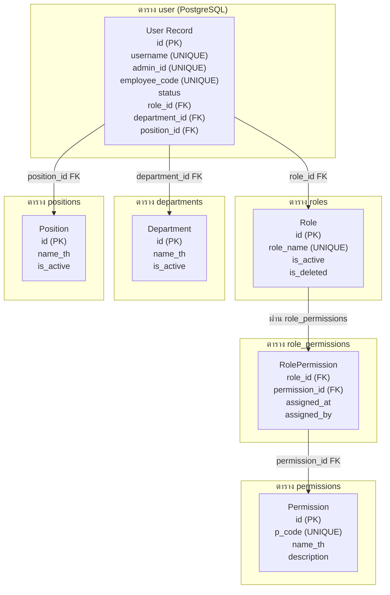
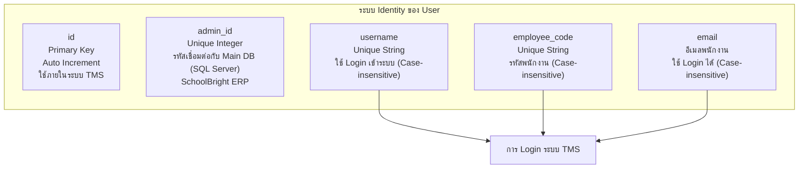
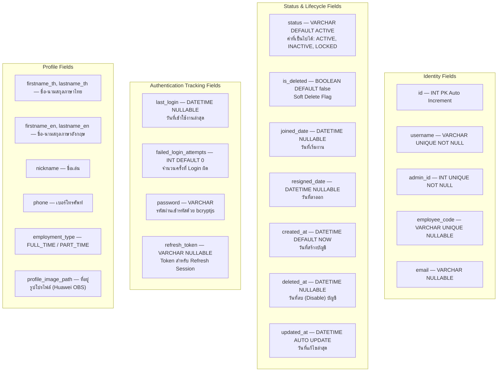
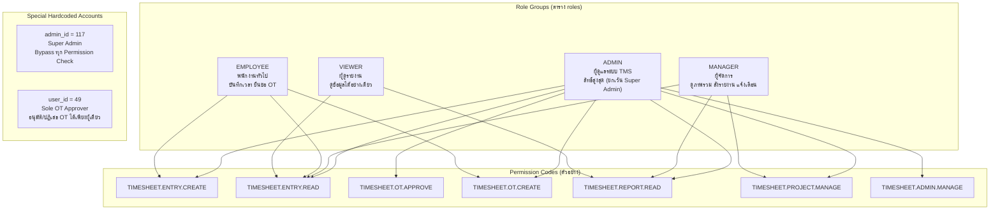
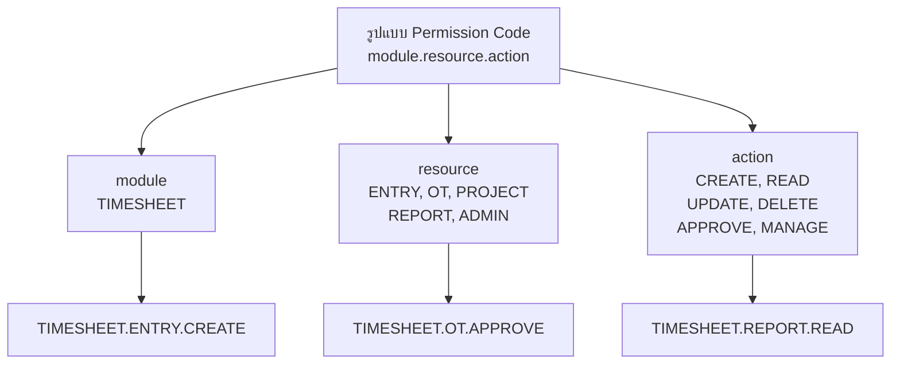
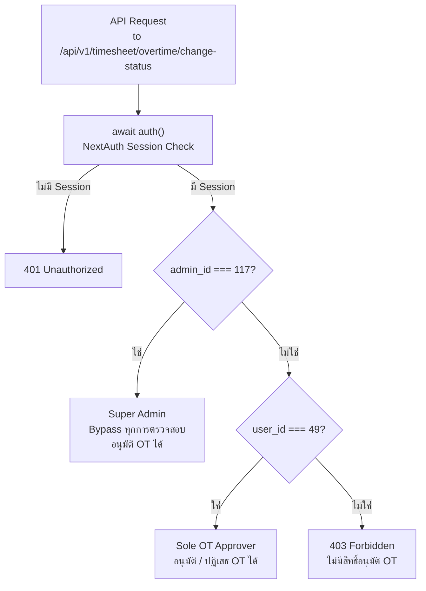
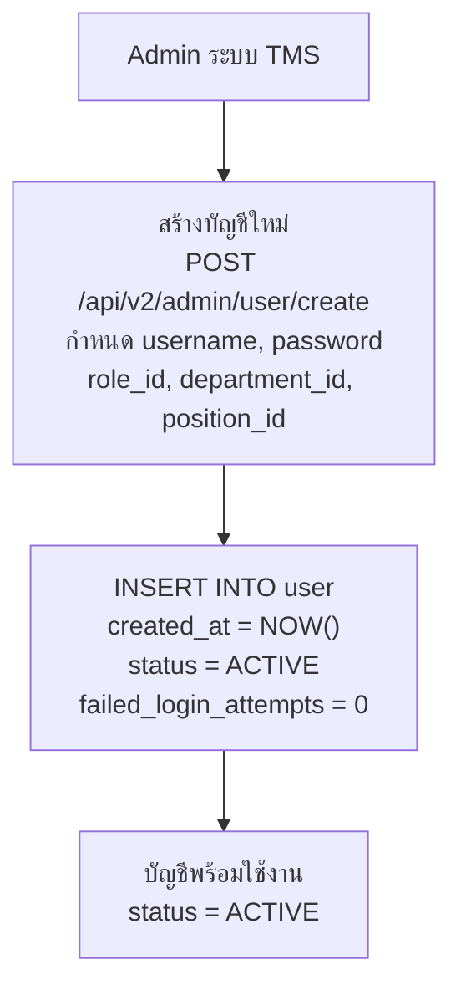
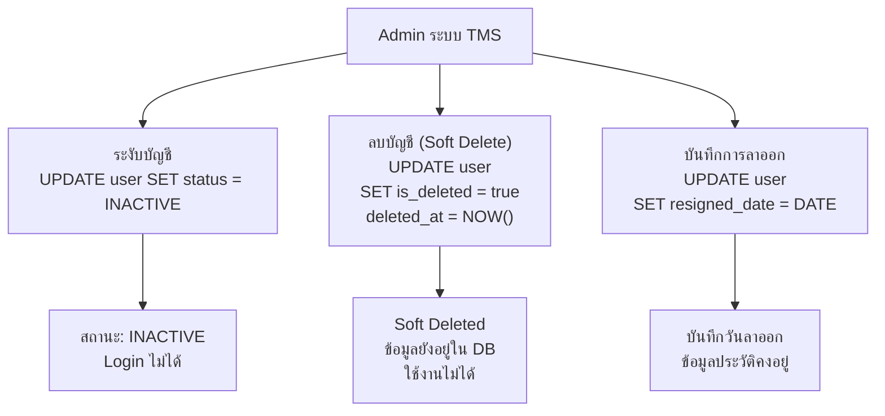
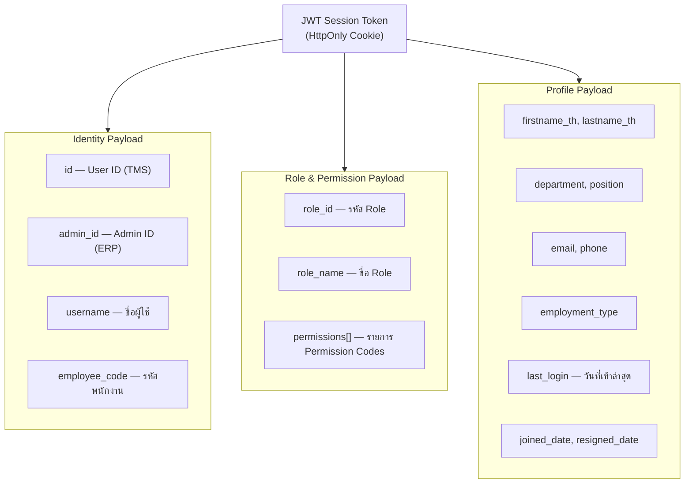

# รายละเอียดรหัสผู้ใช้งานในระบบ (User ID Report)

## ระบบบริหารจัดการเวลาทำงาน — Timesheet Management System

> **Organization:** SchoolBright Co., Ltd.
> **System Scope:** Timesheet Management System (TMS) — เฉพาะระบบ Timesheet เท่านั้น
> **Document Version:** 2.4.45
> **Prepared Date:** 22 เมษายน พ.ศ. 2569
> **Classification:** INTERNAL — FOR AUDITOR USE ONLY

## สารบัญ (Table of Contents)

| หมวด | รายการ                                             |
| ---- | -------------------------------------------------- |
| 1    | ภาพรวมโครงสร้างผู้ใช้งาน (User Structure Overview) |
| 2    | โมเดลข้อมูลผู้ใช้งาน (User Data Model)             |
| 3    | สถานะรหัสผู้ใช้งาน (User Status Definition)        |
| 4    | กลุ่มผู้ใช้งานและสิทธิ์ (User Groups & Roles)      |
| 5    | บัญชีผู้ใช้งานพิเศษ (Special System Accounts)      |
| 6    | วงจรชีวิตรหัสผู้ใช้งาน (User Account Lifecycle)    |
| 7    | การ Login และ Session (Authentication Tracking)    |
| 8    | รายการฟิลด์ข้อมูลผู้ใช้งาน (User Field Registry)   |

## 1. ภาพรวมโครงสร้างผู้ใช้งาน (User Structure Overview)

**Diagram 1.1 — ความสัมพันธ์ระหว่าง User กับ Role และ Permission**



**Diagram 1.2 — ระบบ Identity ของ User**



## 2. โมเดลข้อมูลผู้ใช้งาน (User Data Model)

**Diagram 2.1 — ฟิลด์ที่เกี่ยวข้องกับ User Identity และ Status**



## 3. สถานะรหัสผู้ใช้งาน (User Status Definition)

| สถานะ               | ค่าในฐานข้อมูล                                       | ความหมาย                       | Login ได้หรือไม่                  |
| ------------------- | ---------------------------------------------------- | ------------------------------ | --------------------------------- |
| ใช้งานได้           | `status = "ACTIVE"` และ `is_deleted = false`         | บัญชีปกติ พร้อมใช้งาน          | ได้                               |
| ถูกล็อคชั่วคราว     | `status = "ACTIVE"` แต่ `failed_login_attempts >= 5` | ล็อคอัตโนมัติ 15 นาที          | ไม่ได้ (Auto-unlock หลัง 15 นาที) |
| ไม่ได้ใช้งาน        | `status = "INACTIVE"`                                | ถูกระงับโดย Admin              | ไม่ได้                            |
| ถูกลบ (Soft Delete) | `is_deleted = true` และ `deleted_at != null`         | Soft Delete ข้อมูลยังอยู่ใน DB | ไม่ได้                            |
| ลาออก               | `resigned_date != null`                              | มีวันที่ลาออกบันทึกไว้         | ขึ้นอยู่กับ status                |

**Diagram 3.1 — วงจรสถานะ User Account**

```mermaid
flowchart TD
    CREATE["Admin สร้างบัญชีใหม่\ncreated_at = NOW()"]
    ACTIVE["สถานะ: ACTIVE\nLogin ได้ปกติ"]
    LOCKED["สถานะ: ล็อคชั่วคราว\nfailed_login_attempts >= 5\nAuto-unlock หลัง 15 นาที"]
    INACTIVE["สถานะ: INACTIVE\nAdmin ระงับการใช้งาน"]
    DELETED["Soft Deleted\nis_deleted = true\ndeleted_at = NOW()"]

    CREATE --> ACTIVE
    ACTIVE -->|Login ผิด 5 ครั้ง| LOCKED
    LOCKED -->|ผ่าน 15 นาที (Auto-unlock)| ACTIVE
    ACTIVE -->|Admin ระงับ| INACTIVE
    INACTIVE -->|Admin เปิดใช้งาน| ACTIVE
    ACTIVE -->|Admin ลบบัญชี| DELETED
    INACTIVE -->|Admin ลบบัญชี| DELETED
```

## 4. กลุ่มผู้ใช้งานและสิทธิ์ (User Groups & Roles)

**Diagram 4.1 — โครงสร้าง Role-Based Access Control**



**Diagram 4.2 — Permission Pattern**



## 5. บัญชีผู้ใช้งานพิเศษ (Special System Accounts)

| รหัส             | ประเภท           | เงื่อนไขในโค้ด                  | สิทธิ์พิเศษ                                           | หมายเหตุ                                                                                     |
| ---------------- | ---------------- | ------------------------------- | ----------------------------------------------------- | -------------------------------------------------------------------------------------------- |
| `admin_id = 117` | Super Admin      | `session.user.admin_id === 117` | Bypass ทุก Permission Check ทั้ง Frontend และ Backend | ห้ามลบหรือแก้ไข hardcoded value นี้                                                          |
| `user_id = 49`   | Sole OT Approver | `session.user.id === "49"`      | อนุมัติ/ปฏิเสธ OT ได้เพียงผู้เดียว                    | ตรวจสอบทั้ง Frontend (`overtime/page.tsx`) และ API Route (`overtime/change-status/route.ts`) |

**Diagram 5.1 — Special Account Authorization Flow**



## 6. วงจรชีวิตรหัสผู้ใช้งาน (User Account Lifecycle)

**Diagram 6.1 — การสร้างและบริหารบัญชี**



**Diagram 6.2 — การระงับและลบบัญชี**



## 7. การ Login และ Session (Authentication Tracking)

**Diagram 7.1 — การติดตามการ Login**

```mermaid
flowchart TD
    LOGIN_ATTEMPT["พยายาม Login"]
    FIND_USER["ค้นหา User จาก\nusername หรือ employee_code หรือ email\n(Case-insensitive)"]
    USER_FOUND{"พบ User และ\nis_deleted = false?"}
    NOT_FOUND["ส่งคืน INVALID_CREDENTIALS"]
    CHECK_STATUS{"status = ACTIVE?"}
    LOCKED_OUT["ส่งคืน ACCOUNT_LOCKED_OR_INACTIVE"]
    CHECK_ATTEMPTS{"failed_login_attempts >= 5?"}
    CHECK_TIME{"ผ่านไปน้อยกว่า 15 นาที?"}
    STILL_LOCKED["ส่งคืน MAX_ATTEMPTS_EXCEEDED"]
    VERIFY_PW["ตรวจสอบรหัสผ่าน\nbcryptjs.compare (primary)\nplain-text fallback (legacy)"]
    PW_WRONG["INCREMENT failed_login_attempts\nส่งคืน INVALID_CREDENTIALS"]
    SUCCESS["Reset failed_login_attempts = 0\nUPDATE last_login = NOW()\nสร้าง JWT Session Token"]

    LOGIN_ATTEMPT --> FIND_USER
    FIND_USER --> USER_FOUND
    USER_FOUND -->|ไม่พบ| NOT_FOUND
    USER_FOUND -->|พบ| CHECK_STATUS
    CHECK_STATUS -->|ไม่ ACTIVE| LOCKED_OUT
    CHECK_STATUS -->|ACTIVE| CHECK_ATTEMPTS
    CHECK_ATTEMPTS -->|ไม่เกิน| VERIFY_PW
    CHECK_ATTEMPTS -->|เกิน| CHECK_TIME
    CHECK_TIME -->|ใช่ (ยังล็อคอยู่)| STILL_LOCKED
    CHECK_TIME -->|ไม่ใช่ (หมดเวลา)| VERIFY_PW
    VERIFY_PW -->|ผิด| PW_WRONG
    VERIFY_PW -->|ถูก| SUCCESS
```

**Diagram 7.2 — ข้อมูลใน JWT Session Token**



## 8. รายการฟิลด์ข้อมูลผู้ใช้งาน (User Field Registry)

| ฟิลด์                   | ประเภทข้อมูล | Constraint          | คำอธิบาย                                   | เกี่ยวข้องกับ Audit    |
| ----------------------- | ------------ | ------------------- | ------------------------------------------ | ---------------------- |
| `id`                    | INT          | PK, Auto Increment  | รหัสผู้ใช้งานภายในระบบ TMS                 | ใช้อ้างอิงภายใน        |
| `username`              | VARCHAR      | UNIQUE, NOT NULL    | ชื่อผู้ใช้สำหรับ Login                     | รหัสผู้ใช้งาน          |
| `admin_id`              | INT          | UNIQUE, NOT NULL    | รหัสเชื่อมต่อ ERP (SQL Server)             | รหัสผู้ใช้ ERP/AD      |
| `employee_code`         | VARCHAR      | UNIQUE, NULLABLE    | รหัสพนักงาน                                | รหัสผู้ใช้งาน          |
| `email`                 | VARCHAR      | NULLABLE            | อีเมลพนักงาน                               | Username/Description   |
| `status`                | VARCHAR      | DEFAULT "ACTIVE"    | ACTIVE / INACTIVE / LOCKED                 | สถานะบัญชี             |
| `is_deleted`            | BOOLEAN      | DEFAULT false       | Soft Delete Flag                           | สถานะบัญชี (Disabled)  |
| `role_id`               | INT (FK)     | FK → roles          | บทบาทของผู้ใช้งาน                          | User Group             |
| `department_id`         | INT (FK)     | FK → departments    | แผนกที่สังกัด                              | User Group             |
| `created_at`            | DATETIME     | DEFAULT NOW()       | วันที่สร้างบัญชี                           | วันที่สร้าง            |
| `deleted_at`            | DATETIME     | NULLABLE            | วันที่ลบ/ปิดบัญชี                          | วันที่ Disable         |
| `last_login`            | DATETIME     | NULLABLE            | วันที่เข้าระบบล่าสุด                       | วันที่เข้าล่าสุด       |
| `updated_at`            | DATETIME     | AUTO UPDATE         | วันที่แก้ไขรหัสผ่านล่าสุด                  | วันที่เปลี่ยน Password |
| `joined_date`           | DATETIME     | NULLABLE            | วันที่เริ่มงาน                             | ข้อมูลเพิ่มเติม        |
| `resigned_date`         | DATETIME     | NULLABLE            | วันที่ลาออก                                | ข้อมูลเพิ่มเติม        |
| `failed_login_attempts` | INT          | DEFAULT 0           | จำนวนครั้ง Login ผิด                       | Security Tracking      |
| `employment_type`       | VARCHAR      | DEFAULT "FULL_TIME" | FULL_TIME / PART_TIME                      | ประเภทการจ้างงาน       |
| `password`              | VARCHAR      | NOT NULL            | bcryptjs hash ($2b) หรือ plain-text legacy | ความปลอดภัย            |

> **หมายเหตุสำหรับ Auditor:**
> ฟิลด์ `updated_at` ถูก Auto-update ทุกครั้งที่มีการแก้ไข record ใดๆ รวมถึงการเปลี่ยนรหัสผ่าน
> ระบบไม่มีตาราง `password_history` โดยเฉพาะ — การติดตามการเปลี่ยนรหัสผ่านใช้ `updated_at` เป็นหลัก

> **Document Control**
>
> | รายการ              | รายละเอียด                                                               |
> | ------------------- | ------------------------------------------------------------------------ |
> | ผู้จัดทำ            | Senior Full-Stack Developer, SchoolBright                                |
> | วันที่จัดทำ         | 22 เมษายน พ.ศ. 2569                                                      |
> | เวอร์ชันเอกสาร      | 1.0.0                                                                    |
> | อ้างอิงจาก          | src/auth.ts, prisma/timesheet/schema.prisma, src/app/api/v1/timesheet/\* |
> | ระดับความลับ        | INTERNAL — FOR AUDITOR USE ONLY                                          |
> | เอกสารที่เกี่ยวข้อง | password-parameter.md, application-list.md                               |

_เอกสารนี้สร้างจาก Source Code จริงของระบบ SchoolBright Timesheet Management System_
_สงวนสิทธิ์ — SchoolBright Co., Ltd._
