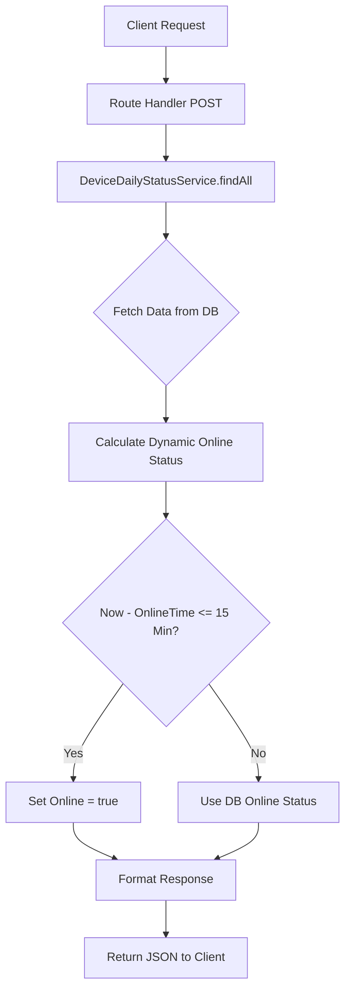

# API Specification: Check Device Status (v2)

วัตถุประสงค์ของ API นี้คือเพื่อดึงรายการสถานะการเชื่อมต่อ (Online/Offline) และสถานะการใช้งาน (Login/Logout) ของอุปกรณ์ฮาร์ดแวร์ทั้งหมดในระบบ โดยมีการคำนวณสถานะ Online แบบ Real-time เพื่อความแม่นยำ

## Business Logic

เนื่องจากสถานะ `Online` (Boolean) ในฐานข้อมูลอาจมีความล่าช้า (Stale) ระบบจึงเปลี่ยนมาใช้การคำนวณสถานะแบบ **Dynamic** โดยใช้เงื่อนไขดังนี้:

> **เงื่อนไขสถานะออนไลน์:**
>
> 1. ค่า `Online` ในฐานข้อมูลเป็น `true`
> 2. **หรือ** `OnlineTime` (เวลา Heartbeat ล่าสุด) มีระยะห่างจากเวลาปัจจุบัน **ไม่เกิน 15 นาที**

## Workflows Diagram



## Request Schema (Snake Case)

| Field        | Type      | Description                      |
| :----------- | :-------- | :------------------------------- |
| `page`       | `number`  | หมายเลขหน้า (Default: 1)         |
| `limit`      | `number`  | จำนวนรายการต่อหน้า (Default: 10) |
| `is_online`  | `boolean` | กรองตามสถานะออนไลน์              |
| `is_login`   | `boolean` | กรองตามสถานะการเข้าใช้งาน        |
| `start_date` | `string`  | วันที่เริ่มต้น (ISO Format)      |
| `end_date`   | `string`  | วันที่สิ้นสุด (ISO Format)       |
| `keyword`    | `string`  | ค้นหาด้วย DeviceID หรือ SchoolID |

## Response Schema

```json
{
  "status_code": 200,
  "message_th": "ดึงข้อมูลสถานะอุปกรณ์สำเร็จ",
  "message_en": "Device status retrieved successfully",
  "data": [
    {
      "DeviceStatusID": "uuid",
      "SchoolID": 1205,
      "DeviceID": "6d7b92bf1f49295d",
      "Online": true,
      "OnlineTime": "2026-04-17T11:47:46.661Z",
      "Login": true,
      "AppName": "SB Facial Attendance 8 inch",
      "AppVersion": "1.2.9",
      "Tstamp": "2026-04-17T11:47:46.661Z"
    }
  ],
  "pagination": {
    "page": 1,
    "page_size": 10,
    "total": 100,
    "total_pages": 10
  }
}
```

## Logic Note

- การใช้ `OnlineTime` มาคำนวณช่วยแก้ปัญหาเครื่องที่ปิดไม่สมบูรณ์ หรือสัญญาณเน็ตหลุดแต่ DB ยังค้างสถานะเก่า
- ค่า `15 นาที` เป็นค่าที่เหมาะสมสำหรับอัตราการส่ง Heartbeat ของอุปกรณ์ปัจจุบัน
